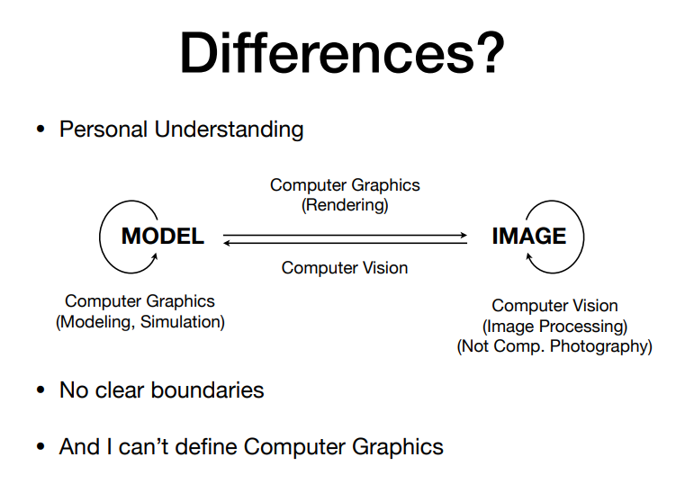

# 绪论

1. **光栅化（Rasterization）**：把三维空间的几何形体显示在屏幕上

**实时（Realtime）**在计算机图形学中的定义：每秒钟能生成30幅画面/30帧/30fps，否则就称之为**离线（Offline）**

2. **曲线与曲面（Curves and Meshes）**：如何表示光滑的曲线、光滑的曲面；简单曲面通过**曲面细分**的方法得到复杂曲面；保持物体的拓扑结构

3. **光线追踪（Ray Tracing）**：动画和电影中经常使用；速度慢但是可以生成真实、美观、质量高的画面（Trade-off）
4. **动画/模拟/仿真（Animation/Simulation）**

计算机图形学和计算机视觉的区别：

