# Linear Algebra 线性代数

[TOC]

图形学依赖于：

- 基础数学：线性代数，微积分，统计
- 基础物理：光学，力学
- 其他：信号处理，数值分析
- 美学

## 1.Vectors 向量

向量的两个重要属性：**方向、长度**

**单位向量（Unit Vector）**：长度为一的向量，只用来表示方向，写法为：

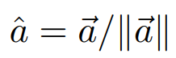

向量的基本操作：

- 向量求和（平行四边形法则/三角形法则/坐标相加）
- 向量求模（坐标平方和开根号）
- 向量点乘
- 向量叉乘

### 向量点乘

向量**点乘公式**：

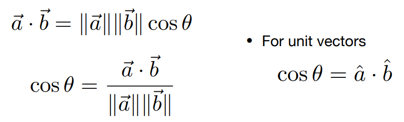

点乘满足**交换律、结合律、分配律**：

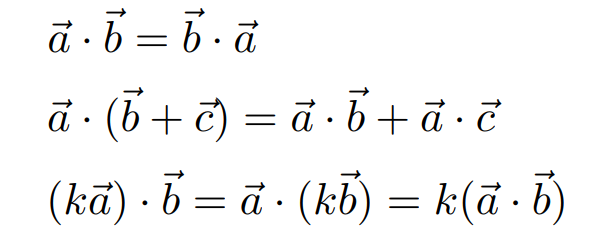

点乘的**坐标系运算**：

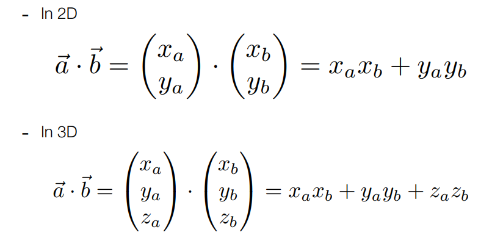

点乘在**投影运算**中的应用：

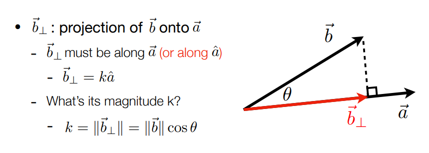

点乘在图形学中的作用：==判断向量的同向反向、接近程度；分解一个向量==

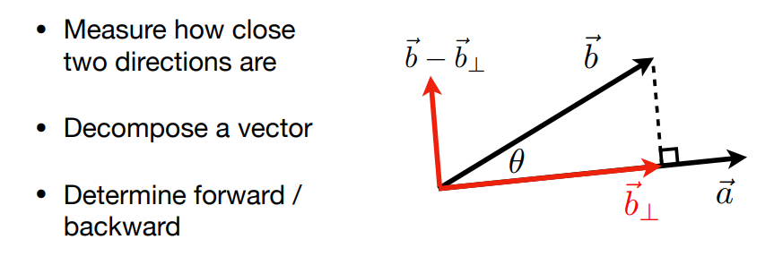

### 向量叉乘

向量**叉乘公式**：

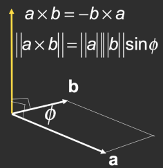

叉乘满足**结合律、分配律，不满足交换律**：

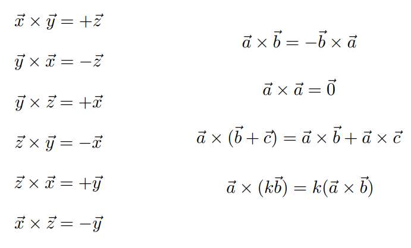

如果x叉乘y得到z则是右手坐标系，x叉乘y得到-z则是左手坐标系

叉乘的**坐标系运算**：

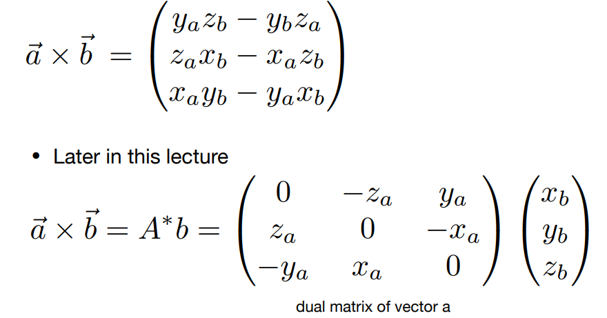

叉乘在图形学中的作用：==判定左右、判定内外==

- 叉乘结果是正的说明后项向量在前项向量的左侧，叉乘结果是负的说明后项向量在前项向量的右侧；

- 由此可以得到点在图形内还是在图形外

**右手正交直角坐标系**的定义：

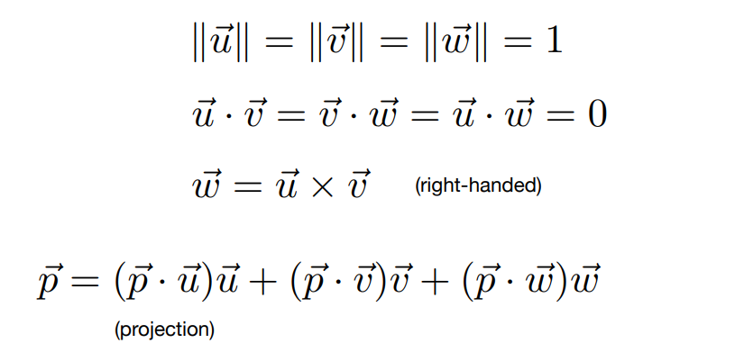

## 2.Matrices 矩阵

矩阵的**乘积**：矩阵乘积的i行j列元素 = i行向量**点乘**j行向量

矩阵乘积**不满足交换律**，满足**结合律和分配律**

矩阵的**转置**操作：行和列互换

**单位矩阵**和**矩阵的逆**：

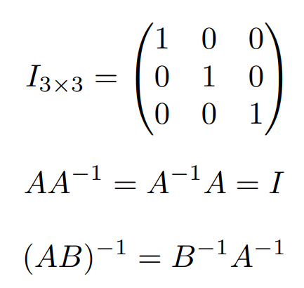

**点乘和叉乘**的矩阵表示：

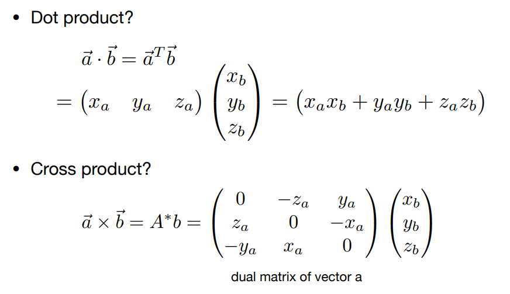

A*：伴随矩阵

## 3.Transformation 变换

### Modeling Transformation 模型变换

引入齐次坐标前的线性变换：

**缩放矩阵**

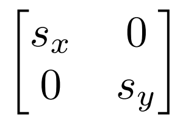

**镜像矩阵（沿y轴）**

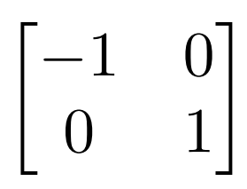

**切变矩阵**

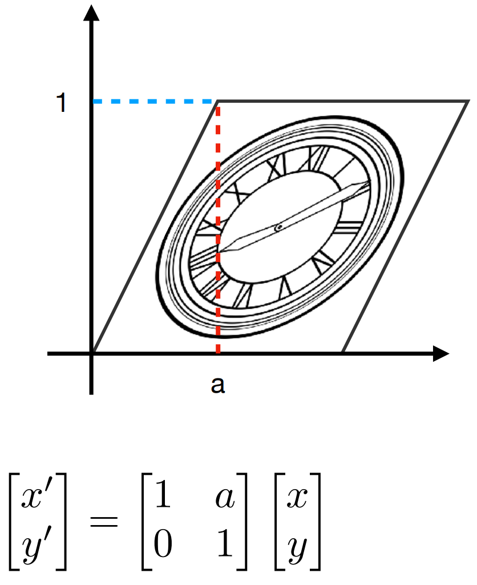

**旋转矩阵（逆时针）**

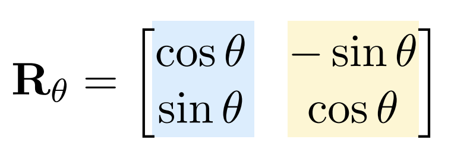

**==齐次坐标变换==**

引入齐次坐标的意义：将平移操作合入变换矩阵中

引入齐次坐标：

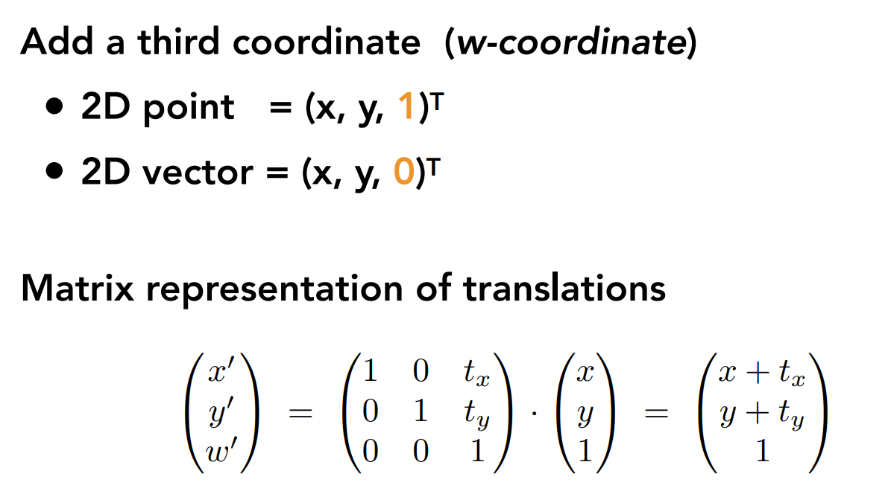

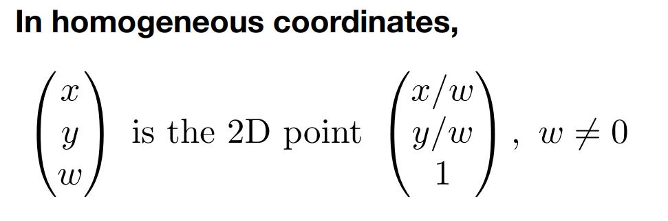

**仿射变换：**

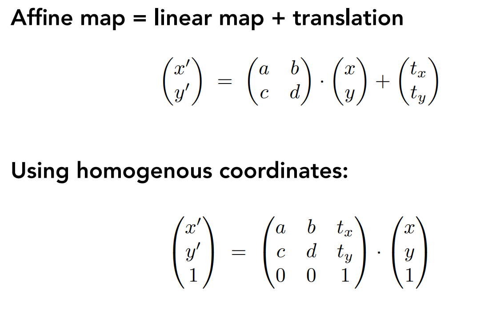

==**引入齐次坐标后的变换**：==

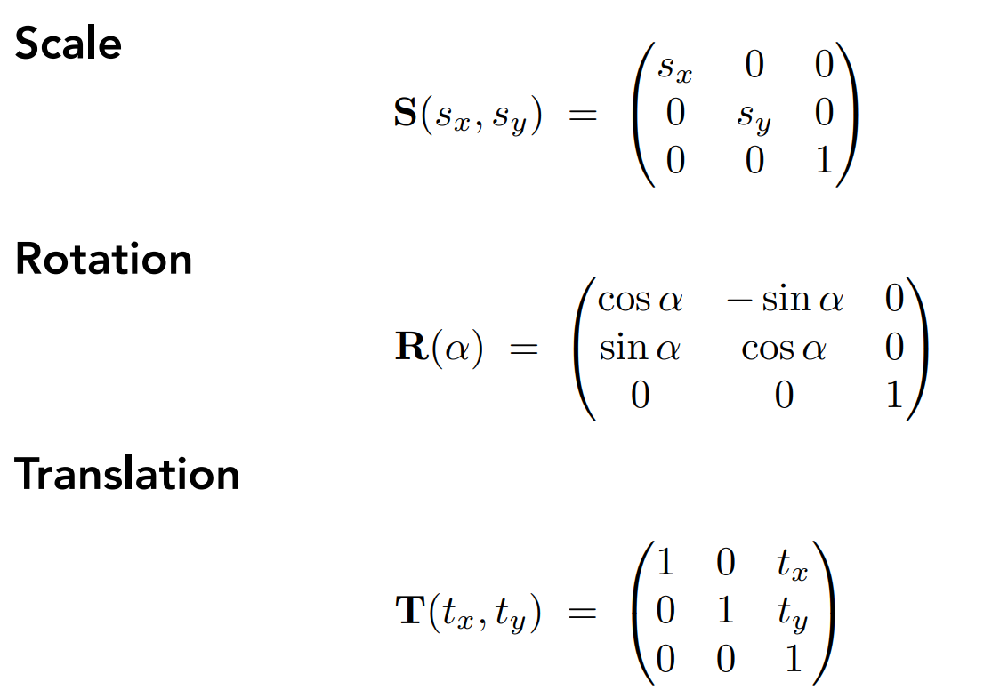

发现：R(θ)^-1^ = R(-θ) = R(θ)^T^

如果一个矩阵的转置等于矩阵的逆，那么该矩阵称为**正交矩阵**

**逆变换**：把原来的操作反过来，将原来的变换还原：M ➡ M^-1^

向量会==从右向左==逐个运用变换矩阵

**三维空间**引入齐次变换与三维仿射变换矩阵：

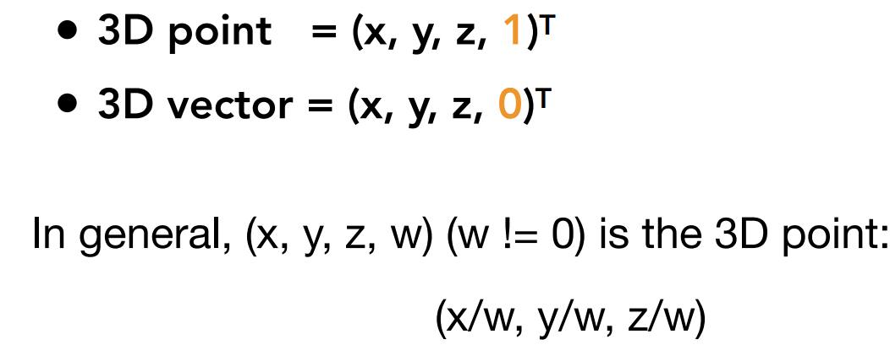

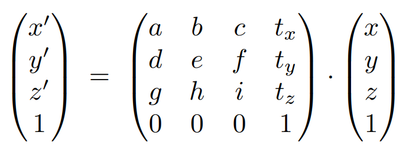

三维空间**绕x、y、z轴**旋转：

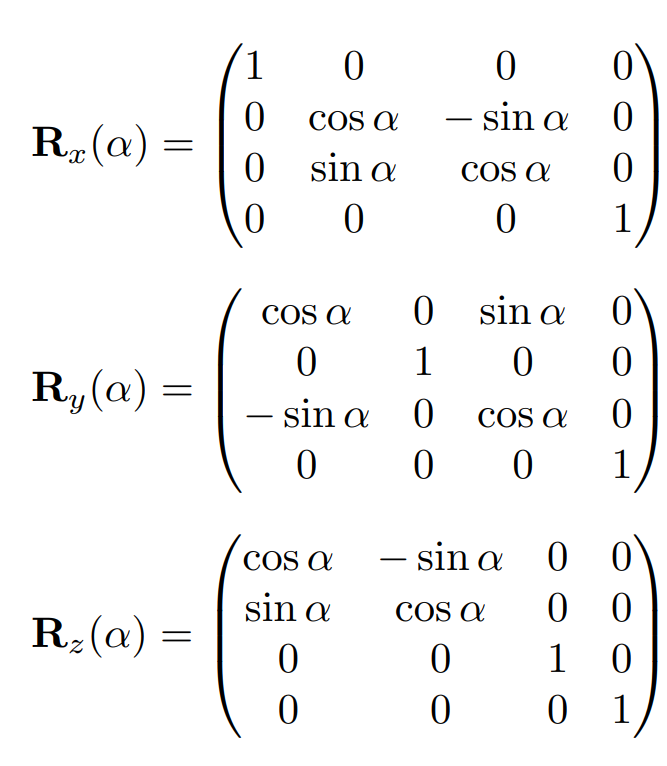

**罗德里格斯**绕任意轴旋转公式：

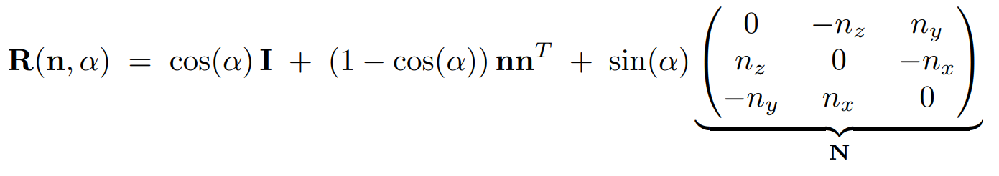

四元数主要是旋转做插值用途

### Viewing Transformation 视图变换

#### 视图变换

视图变换相当于摆照相机：改变相机位置、方向

初始相机定义：位置（position）、面向（look-at/gaze direction）、向上方向(up direction)

相机标准位置：**位于原点，向上方向为Y，面向为朝向-Z**

相机变换矩阵：先平移后旋转

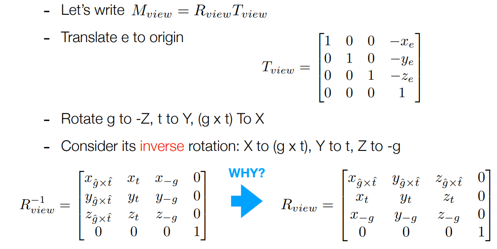

#### 投影变换

正交投影不会有近大远小的效果，而透视投影会

##### 正交投影

映射到标准立方体（-1~1）：先把中心点平移到原点，再进行缩放

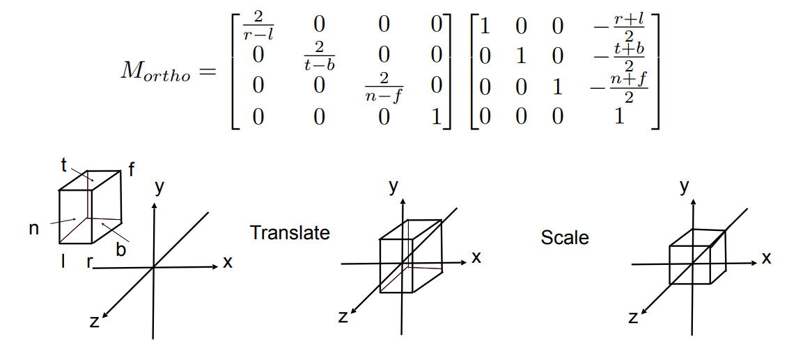

##### 透视投影

将透视立方体挤压，根据近平面、远平面z值不变，得到映射到非标准立方体的变换矩阵：

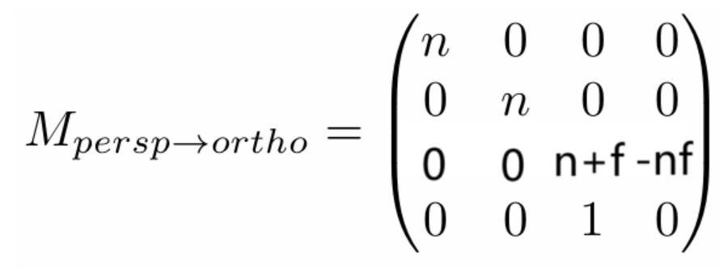