# TinyRenderer

[TOC]


参考课程：[Tiny renderer: Lession 0-2 (youtube.com)](https://www.youtube.com/watch?v=Dy_jbA_fwFk&list=PLsYRP8pwiVX_CrqYJOhCS6LxewZZ6lDLr)

点绘制

```c++
#include "tgaimage.h"

const TGAColor white = TGAColor(255, 255, 255, 255);
const TGAColor red = TGAColor(255, 0, 0, 255);

int main(int argc, char** argv) {
    TGAImage image(100, 100, TGAImage::RGB);
    image.set(52, 41, red);
    image.flip_vertically(); //把原点放在左下角而不是左上角
    image.write_tga_file("output.tga");
    return 0;
}
```


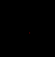

## 1. 布雷森汉姆直线算法 Bresenham's line algorithm

### 第一种绘制方法

```c++
void line(int x0, int y0, int x1, int y1, TGAImage& image, TGAColor color)
{
    for (float t = 0; t < 1; t += 0.01)//固定画100次
    {
        int x = x0 + (x1 - x0) * t;
        int y = y0 + (y1 - y0) * t;//在x0与x1以及y0与y1之间线性插值
        image.set(x, y, color);
    }
}
```

```c++
line(0, 0, 500, 500, image, white);
```

效果：一百个点导致间隙很大

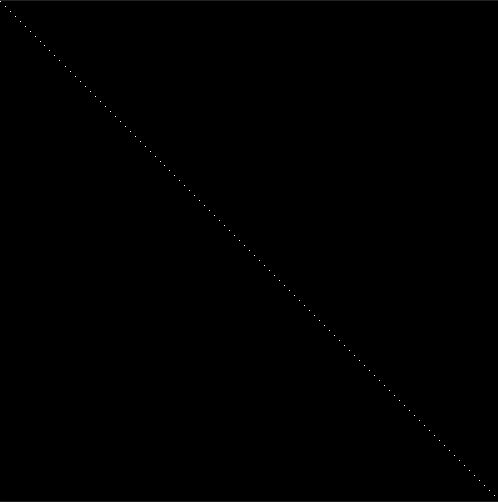

### 第二种绘制方法

```c++
void line(int x0, int y0, int x1, int y1, TGAImage& image, TGAColor color)
{
    for (int x = x0; x <= x1; x++)//最小x和最大x的差距是多大就画多少次
    {
        float t = (x - x0) / (float)(x1 - x0);
        int y = y0 * (1. - t) + y1 * t;
        image.set(x, y, color);
    }
}
```

```c++
line(0, 0, 500, 500, image, white);
line(40, 40, 60, 260, image, white);
line(40, 40, 260, 60, image, white);
```

效果：当y变化跨度大于x的时候，会有间隙

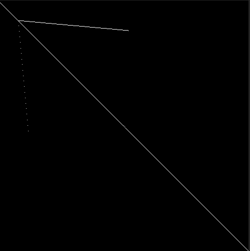

### 第三种绘制方法

```c++
void line(int x0, int y0, int x1, int y1, TGAImage& image, TGAColor color)
{
    bool steep = false;
    if (std::abs(x0 - x1) < std::abs(y0 - y1))
    {
        std::swap(x0, y0);
        std::swap(x1, y1);
        steep = true;

    }
    for (int x = x0; x <= x1; x++)//以x和y中跨度最大的像素数量为步数
    {
        float t = (x - x0) / (float)(x1 - x0);
        int y = y0 * (1. - t) + y1 * t;
        if (steep)
        {
            image.set(y, x, color);
        }
        else
        {
            image.set(x, y, color);
        }
    }
}
```

```c++
line(-100, -100, 500, 500, image, white);
line(40, 40, 60, 260, image, white);
line(40, 40, 260, 60, image, white);
```

效果：对角线存在扭曲

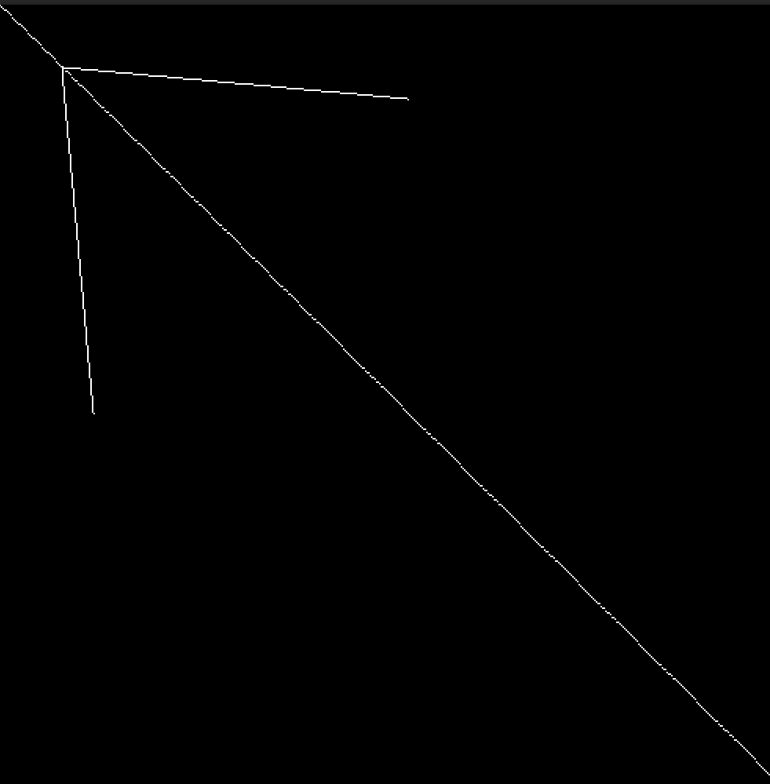

### 第四种绘制方式

参考：[[学习\]bresenham算法绘制直线_哔哩哔哩_bilibili](https://www.bilibili.com/video/BV1364y1d7Lo/?spm_id_from=333.337.search-card.all.click&vd_source=1144610de5ae0bf9c26dfc9f98e02f2f)

主要是解决y的偏差

```c++
void line(int x0, int y0, int x1, int y1, TGAImage& image, TGAColor color)
{
    bool steep = false;
    if (std::abs(x0 - x1) < std::abs(y0 - y1))
    {
        std::swap(x0, y0);
        std::swap(x1, y1);
        steep = true;
    }
    int dx = x1 - x0;
    int dy = y1 - y0;
    float derror = std::abs(dy / float(dx));//斜率，derror一定大于0小于1
    float error = 0;//累加值
    int y = y0;
    for (int x = x0; x <= x1; x++)
    {
        if (steep)
        {
            image.set(y, x, color);
        }
        else
        {
            image.set(x, y, color);
        }
        error += derror;
        if (error > 0.5)
        {
            y += (y1 > y0 ? 1 : -1);
            error -= 1.0;
        }
    }
}
```

效果：解决了对角线扭曲的问题

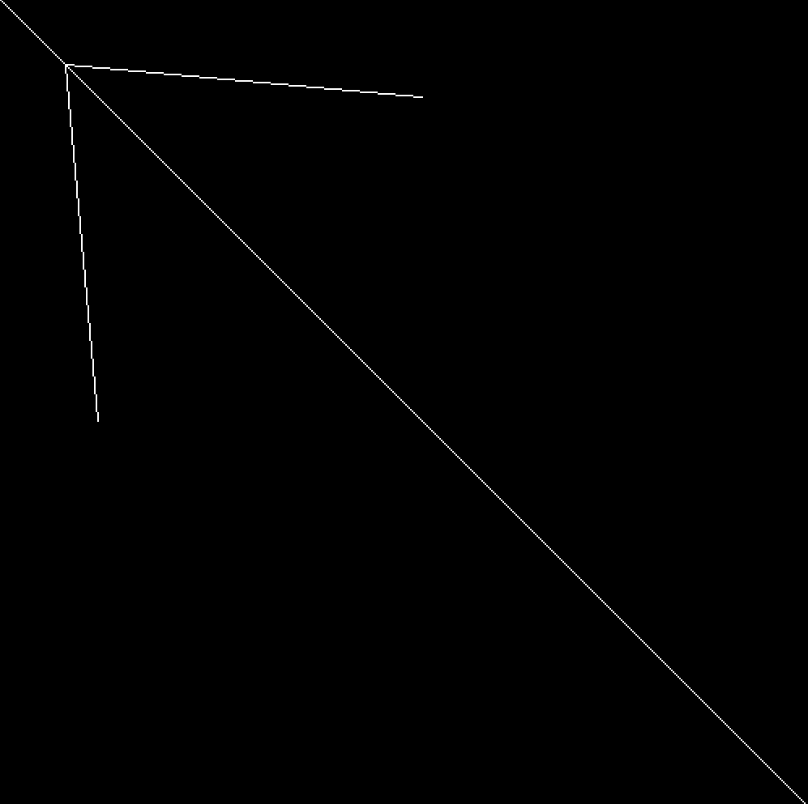

### 第五种绘制方式

```c++
void line(int x0, int y0, int x1, int y1, TGAImage& image, TGAColor color)
{
    bool steep = false;
    if (std::abs(x0 - x1) < std::abs(y0 - y1))
    {
        std::swap(x0, y0);
        std::swap(x1, y1);
        steep = true;
    }
    int dx = x1 - x0;
    int dy = y1 - y0;
    float derror = std::abs(dy) * 2;//这里做了修改
    float error = 0;
    int y = y0;
    for (int x = x0; x <= x1; x++)
    {
        if (steep)
        {
            image.set(y, x, color);
        }
        else
        {
            image.set(x, y, color);
        }
        error += derror;
        if (error > dx)
        {
            y += (y1 > y0 ? 1 : -1);
            error -= dx * 2;
        }
    }
}
```

## 2. 线框渲染 Wireframe Rendering

```c++
int main(int argc, char** argv) {
    if (2 == argc) {
        model = new Model(argv[1]);
    }
    else {
        model = new Model("obj/african_head.obj");
    }

    TGAImage image(width, height, TGAImage::RGB);
    for (int i = 0; i < model->nfaces(); i++) {
        std::vector<int> face = model->face(i);
        for (int j = 0; j < 3; j++) {
            Vec3f v0 = model->vert(face[j]);
            Vec3f v1 = model->vert(face[(j + 1) % 3]);
            int x0 = (v0.x + 1.) * width / 2.;
            int y0 = (v0.y + 1.) * height / 2.;
            int x1 = (v1.x + 1.) * width / 2.;
            int y1 = (v1.y + 1.) * height / 2.;
            line(x0, y0, x1, y1, image, white);
        }
    }

    image.flip_vertically(); // i want to have the origin at the left bottom corner of the image
    image.write_tga_file("output.tga");
    delete model;
    return 0;
}
```

效果：

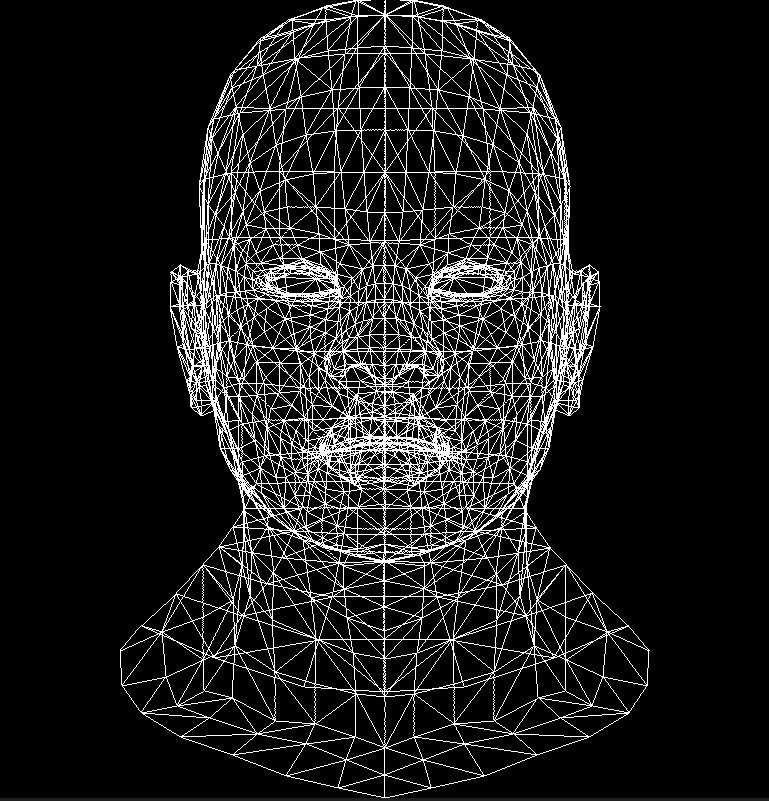

## 3. 三角形光栅化、背面剔除

### 旧做法：Line Sweep Algorithm

```c++
#include "tgaimage.h"
#include "geometry.h"

const TGAColor white = TGAColor(255, 255, 255, 255);
const TGAColor red = TGAColor(255, 0, 0, 255);
const TGAColor green = TGAColor(0, 255, 0, 255);

void line(Vec2i p0, Vec2i p1, TGAImage& image, TGAColor color);
void triangle(Vec2i t0, Vec2i t1, Vec2i t2, TGAImage& image, TGAColor color);

int main(int argc, char** argv) {
    TGAImage image(500, 500, TGAImage::RGB);
    Vec2i t0[3] = { Vec2i(10, 70),   Vec2i(50, 160),  Vec2i(70, 80) };
    Vec2i t1[3] = { Vec2i(180, 50),  Vec2i(150, 1),   Vec2i(70, 180) };
    Vec2i t2[3] = { Vec2i(180, 150), Vec2i(120, 160), Vec2i(130, 180) };
    triangle(t0[0], t0[1], t0[2], image, red);
    triangle(t1[0], t1[1], t1[2], image, white);
    triangle(t2[0], t2[1], t2[2], image, green);
    image.write_tga_file("output.tga");
    return 0;
}

void line(Vec2i p0, Vec2i p1, TGAImage& image, TGAColor color) {
    bool steep = false;
    if (std::abs(p0.x - p1.x) < std::abs(p0.y - p1.y)) {
        std::swap(p0.x, p0.y);
        std::swap(p1.x, p1.y);
        steep = true;
    }
    if (p0.x > p1.x) {
        std::swap(p0, p1);
    }

    for (int x = p0.x; x <= p1.x; x++) {
        float t = (x - p0.x) / (float)(p1.x - p0.x);
        int y = p0.y * (1. - t) + p1.y * t;
        if (steep) {
            image.set(y, x, color);
        }
        else {
            image.set(x, y, color);
        }
    }
}

void triangle(Vec2i t0, Vec2i t1, Vec2i t2, TGAImage& image, TGAColor color) 
{
    //冒泡排序
    if (t0.y > t1.y) std::swap(t0, t1);
    if (t0.y > t2.y) std::swap(t0, t2);
    if (t1.y > t2.y) std::swap(t1, t2);
    line(t0, t1, image, green);
    line(t1, t2, image, green);
    line(t2, t0, image, red);
}
```

效果：

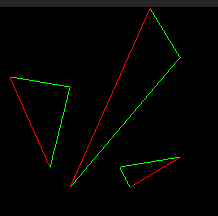

如果按靠上方的绿线部分切割红色线：（同理也可以按靠下方的绿线部分切割红色线）

```c++
void triangle(Vec2i t0, Vec2i t1, Vec2i t2, TGAImage &image, TGAColor color) { 
    if (t0.y>t1.y) std::swap(t0, t1); 
    if (t0.y>t2.y) std::swap(t0, t2); 
    if (t1.y>t2.y) std::swap(t1, t2); 
    int total_height = t2.y-t0.y; 
    for (int y=t0.y; y<=t1.y; y++) { 
        int segment_height = t1.y-t0.y+1; 
        float alpha = (float)(y-t0.y)/total_height; 
        float beta  = (float)(y-t0.y)/segment_height; //注意被除数为0的情况
        Vec2i A = t0 + (t2-t0)*alpha; 
        Vec2i B = t0 + (t1-t0)*beta; 
        image.set(A.x, y, red); 
        image.set(B.x, y, green); 
    } 
}
```

效果：

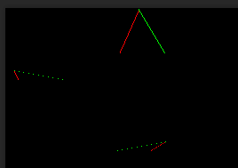

分两部分绘制三角形，每个部分中再加一个循环来填充：

```c++
void triangle(Vec2i t0, Vec2i t1, Vec2i t2, TGAImage &image, TGAColor color) { 
    if (t0.y>t1.y) std::swap(t0, t1); 
    if (t0.y>t2.y) std::swap(t0, t2); 
    if (t1.y>t2.y) std::swap(t1, t2); 
    int total_height = t2.y-t0.y; 
    for (int y=t0.y; y<=t1.y; y++) { 
        int segment_height = t1.y-t0.y+1; 
        float alpha = (float)(y-t0.y)/total_height; 
        float beta  = (float)(y-t0.y)/segment_height; // be careful with divisions by zero 
        Vec2i A = t0 + (t2-t0)*alpha; 
        Vec2i B = t0 + (t1-t0)*beta; 
        if (A.x>B.x) std::swap(A, B); 
        for (int j=A.x; j<=B.x; j++) { 
            image.set(j, y, color); // attention, due to int casts t0.y+i != A.y 
        } 
    } 
    for (int y=t1.y; y<=t2.y; y++) { 
        int segment_height =  t2.y-t1.y+1; 
        float alpha = (float)(y-t0.y)/total_height; 
        float beta  = (float)(y-t1.y)/segment_height; // be careful with divisions by zero 
        Vec2i A = t0 + (t2-t0)*alpha; 
        Vec2i B = t1 + (t2-t1)*beta; 
        if (A.x>B.x) std::swap(A, B); 
        for (int j=A.x; j<=B.x; j++) { 
            image.set(j, y, color); // attention, due to int casts t0.y+i != A.y 
        } 
    } 
}
```

简化重复代码之后：

```c++
void triangle(Vec2i t0, Vec2i t1, Vec2i t2, TGAImage &image, TGAColor color) { 
    if (t0.y==t1.y && t0.y==t2.y) return;
    if (t0.y>t1.y) std::swap(t0, t1); 
    if (t0.y>t2.y) std::swap(t0, t2); 
    if (t1.y>t2.y) std::swap(t1, t2); 
    int total_height = t2.y-t0.y; 
    for (int i=0; i<total_height; i++) { 
        bool second_half = i>t1.y-t0.y || t1.y==t0.y; 
        int segment_height = second_half ? t2.y-t1.y : t1.y-t0.y; 
        float alpha = (float)i/total_height; 
        float beta  = (float)(i-(second_half ? t1.y-t0.y : 0))/segment_height;
        Vec2i A =               t0 + (t2-t0)*alpha; 
        Vec2i B = second_half ? t1 + (t2-t1)*beta : t0 + (t1-t0)*beta; 
        if (A.x>B.x) std::swap(A, B); 
        for (int j=A.x; j<=B.x; j++) { 
            image.set(j, t0.y+i, color);
        } 
    } 
}
```

效果：

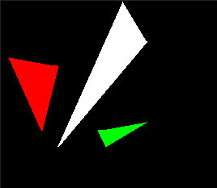

### 优化：用BoundingBox

找到BoundingBox，检查这个BoundingBox中的每个点是否在三角形内，如果在则绘制

Pseudo-code：

```c++
triangle(vec2 points[3]) { 
    vec2 bbox[2] = find_bounding_box(points); 
    for (each pixel in the bounding box) { 
        if (inside(points, pixel)) { 
            put_pixel(pixel); 
        } 
    } 
}
```

barycentric coordinate 重心坐标

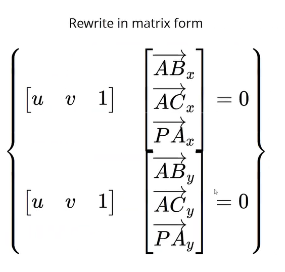

```c++
#include <vector> 
#include <iostream> 
#include "geometry.h"
#include "tgaimage.h" 
 
const int width  = 200; 
const int height = 200; 
 
Vec3f barycentric(Vec2i *pts, Vec2i P) { 
    Vec3f u = Vec3f(pts[2][0]-pts[0][0], pts[1][0]-pts[0][0], pts[0][0]-P[0])^Vec3f(pts[2][1]-pts[0][1], pts[1][1]-pts[0][1], pts[0][1]-P[1]);
    /* `pts` and `P` has integer value as coordinates
       so `abs(u[2])` < 1 means `u[2]` is 0, that means
       triangle is degenerate, in this case return something with negative coordinates */
    if (std::abs(u.z)<1) return Vec3f(-1,1,1);
    return Vec3f(1.f-(u.x+u.y)/u.z, u.y/u.z, u.x/u.z); 
} 
 
void triangle(Vec2i *pts, TGAImage &image, TGAColor color) { 
    Vec2i bboxmin(image.get_width()-1,  image.get_height()-1); 
    Vec2i bboxmax(0, 0); 
    Vec2i clamp(image.get_width()-1, image.get_height()-1); 
    for (int i=0; i<3; i++) { 
        bboxmin.x = std::max(0, std::min(bboxmin.x, pts[i].x));
	bboxmin.y = std::max(0, std::min(bboxmin.y, pts[i].y));

	bboxmax.x = std::min(clamp.x, std::max(bboxmax.x, pts[i].x));
	bboxmax.y = std::min(clamp.y, std::max(bboxmax.y, pts[i].y));
    } 
    Vec2i P; 
    for (P.x=bboxmin.x; P.x<=bboxmax.x; P.x++) { 
        for (P.y=bboxmin.y; P.y<=bboxmax.y; P.y++) { 
            Vec3f bc_screen  = barycentric(pts, P); 
            if (bc_screen.x<0 || bc_screen.y<0 || bc_screen.z<0) continue; 
            image.set(P.x, P.y, color); 
        } 
    } 
} 
 
int main(int argc, char** argv) { 
    TGAImage frame(200, 200, TGAImage::RGB); 
    Vec2i pts[3] = {Vec2i(10,10), Vec2i(100, 30), Vec2i(190, 160)}; 
    triangle(pts, frame, TGAColor(255, 0, 0)); 
    frame.flip_vertically(); 
    frame.write_tga_file("framebuffer.tga");
    return 0; 
}
```

对模型进行绘制：

```c++
int main(int argc, char** argv) {
    if (2 == argc) {
        model = new Model(argv[1]);
    }
    else {
        model = new Model("obj/african_head.obj");
    }
    TGAImage image(width, height, TGAImage::RGB);
    for (int i = 0; i < model->nfaces(); i++) {
        std::vector<int> face = model->face(i);
        Vec2i screen_coords[3];
        for (int j = 0; j < 3; j++) {
            Vec3f world_coords = model->vert(face[j]);
            screen_coords[j] = Vec2i((world_coords.x + 1.) * width / 2., (world_coords.y + 1.) * height / 2.);
        }
        triangle(screen_coords[0], screen_coords[1], screen_coords[2], image, TGAColor(rand() % 255, rand() % 255, rand() % 255, 255));
    }
    image.flip_vertically();
    image.write_tga_file("output.tga");
    delete model;
    return 0;
}
```

效果：

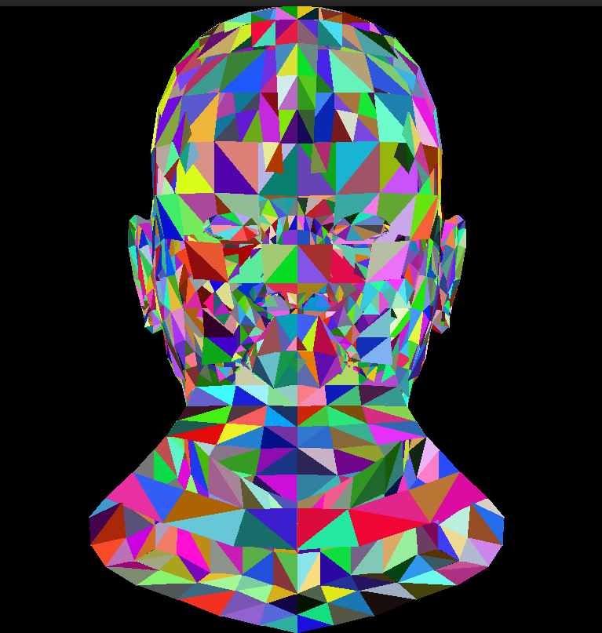