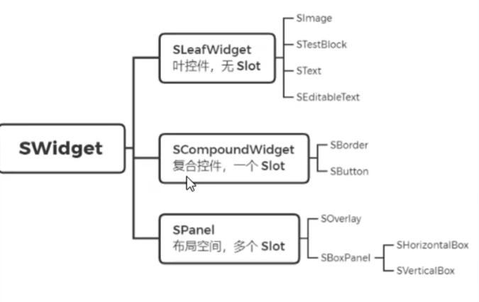
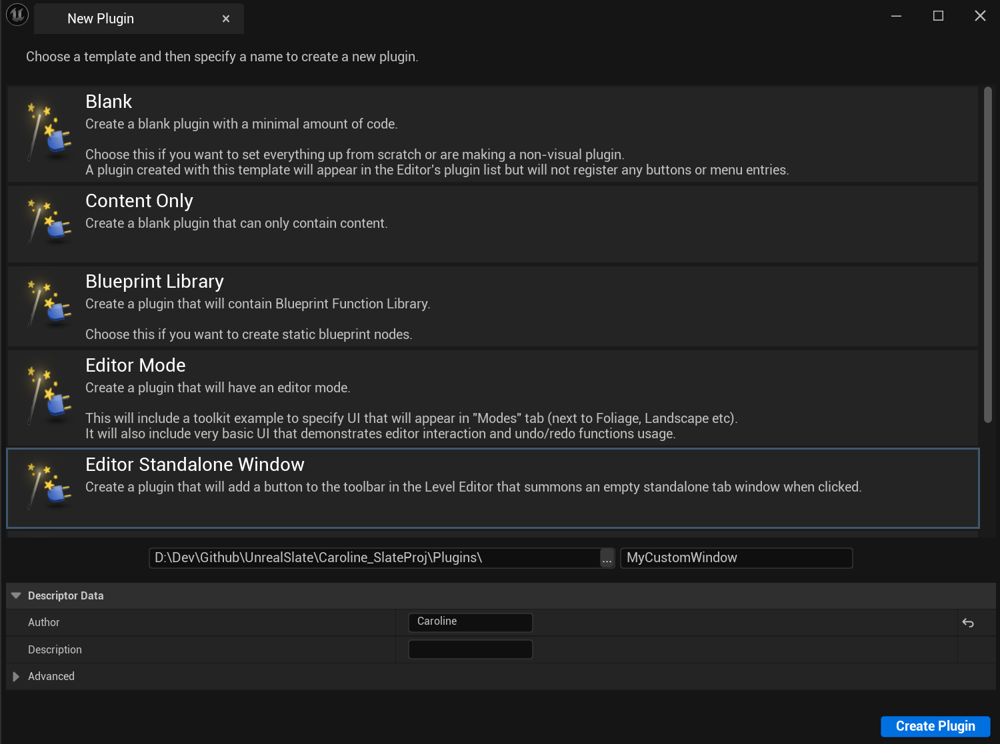
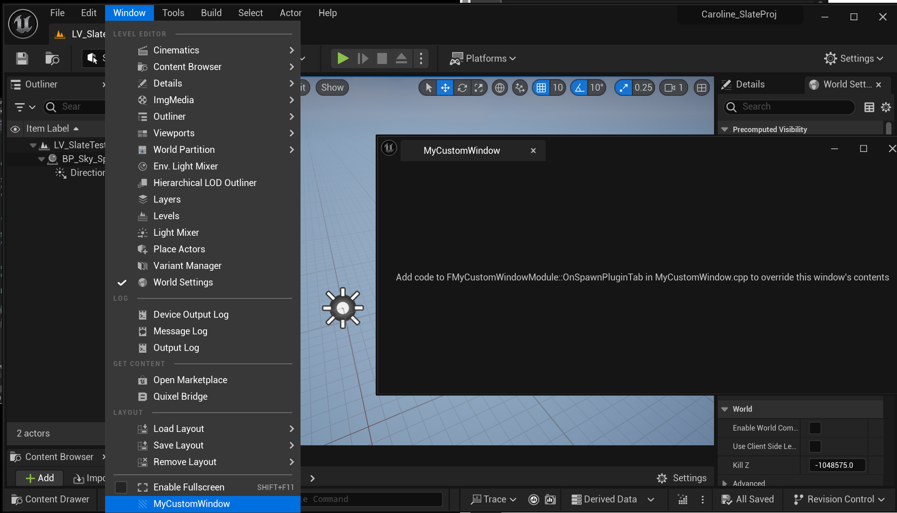
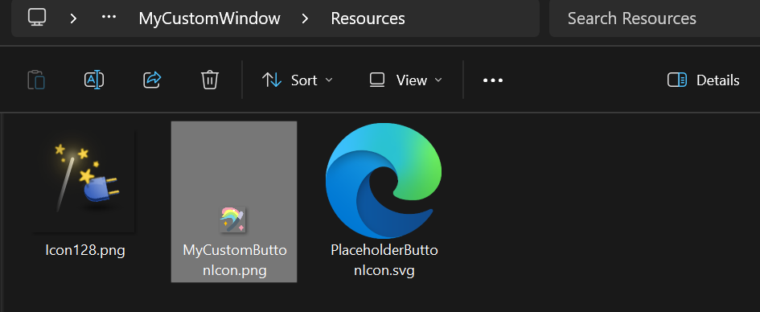
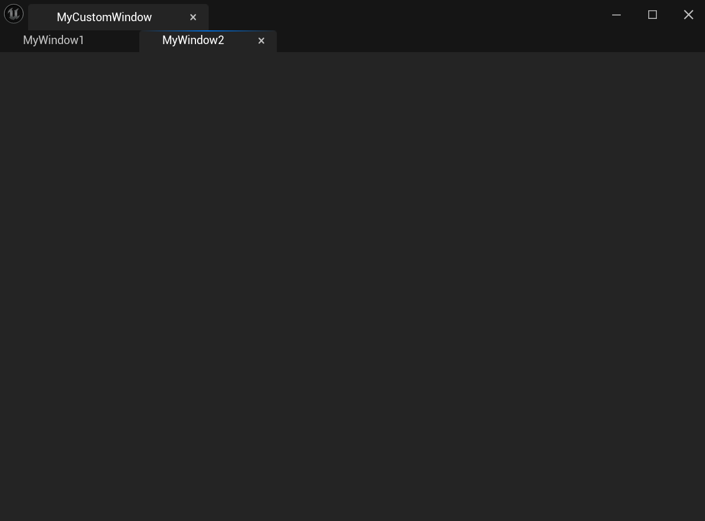
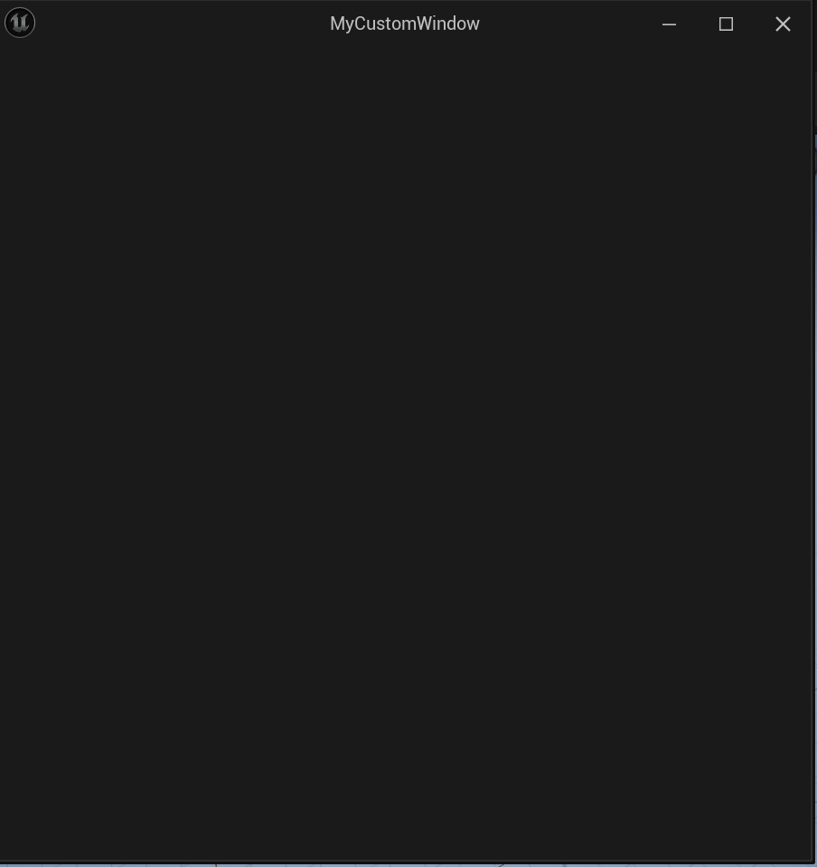
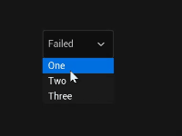

# Unreal Slate

[TOC]


## 概述

Slate实际上是一套UI的框架，UE大部分编辑器界面都是Slate构建的。

Slate是一个分辨率自适应的相对布局界面系统，为了完成这样的目的，slate实际上采用了两次排布的思路:

a. 首先是递归计算每个控件的大小，父控件会根据子控件来计算自己的大小。

b. 根据控件大小，计算出每个控件的绘制位置。

### Slate渲染

所有Slate对象首先会准备渲染的内容，即WindowElement，然后这些内容会交给SlateRHIRenderer负责，最终被绘制出来。

渲染流程为：

a. 将控件对象转换为需要绘制的图形面片。

b. 通过PixelShader和VertexShader来使用GPU绘制

c. 拿回绘图结果，显示在SWindow中

值得做注意的是：Slate的渲染是没有开启深度检测的

### Slate继承方式

所有Slate部件都继承自SWidget，SWidget继承自FSlateControlledConstruction和TSharedFromThis。

SWidget分为SCompoundWidget、SEditableText、SLeafWidget、SMultiLineEditableText、SPanel、SRichTextBlock、SWeakWidget。

SCompoundWidget只含有一个FSimpleSlot类型的ChildSlot，只可以添加一个Child Widget，在Construct()函数里面初始化ChildSlot，简单的布局。例如SBorder、SButton。

SEditableText、SLeafWidget、SMultiLineEditableText、SRichTextBlock不包含ChildSlot，不可以添加Widget。

SPanel可以包含多个ChildWidget， SPanel本身没有Slot结构，继承它的子类自己添加Slot结构，并且实现不同的结构方式，例如SWidgetSwitcher。



### Slate属性方法

Slate提供了一系列宏来初始化控件。

在**SLATE_BEGIN()和SLATE_END_ARGS()之间**声明参数。常见的宏有SLATE_ATTRIBUTE（属性）、 SLATE_EVENT（事件）、SLATE_ARGUMENT（参数）、SLATE_NAMED_SLOT（插槽）和SLATE_DEFAULT_SLOT

### 绘制函数

SLeafWidget和SCompoundWidget是在OnPaint中用FSlateDrawElement绘制。

```c++
virtual int32 OnPaint(...) const override;
```

### 数据更新

UE4提供了函数SynchronizeProperties()，编译时会调用该函数，使得属性能够同步到UI控件上。

```c++
PostEditChangeProperty(FPropertyChangedEvent& PropertyChangedEvent)
    //该函数相应编辑器属性改变事件
```

### SNew和SAssignNew

#### SNew

SNew(SlateWidget 类名)，返回**TShraedRef**

SNew(SWeakWidget).PossiblyNullContent()

#### SAssignNew

SAssignNew(SlateWidget 智能指针，SlateWidget类名)，返回**TSharedPtr**

SAssignNew(SWidget, SWeakWidget).PossiblyNullContent()


## 实现

创建MyCompoundWidget和MyHUD的C++类

### 用Slate写控件布局

```c++
// Lehan Li's Slate Learning Project

#include "Slate/SMyCompoundWidget.h"
#include "SlateOptMacros.h"
#include "Widgets/Layout/SBackgroundBlur.h"

#define LOCTEXT_NAMESPACE "MyNameSpace"

BEGIN_SLATE_FUNCTION_BUILD_OPTIMIZATION
void SMyCompoundWidget::Construct(const FArguments& InArgs)
{
	const FMargin ContentPadding = FMargin(500.0,300.0);
	const FMargin ButtonPadding = FMargin(20.0);
	const FText TitleText = LOCTEXT("SlateTest", "Slate Test");
	const FText PlayButtonText = LOCTEXT("PlayTest", "Play");
	const FText QuitButtonText = LOCTEXT("QuitTest", "Quit");
	FSlateFontInfo ButtonTextStyle = FCoreStyle::Get().GetFontStyle("EmbossedText");//字体样式
	ButtonTextStyle.Size = 40.0f;
	FSlateFontInfo TitleTextStyle = ButtonTextStyle;
	TitleTextStyle.Size = 40.0f;

	ChildSlot
	[
		SNew(SOverlay)
		+SOverlay::Slot()
		.HAlign(HAlign_Fill).VAlign(VAlign_Fill)//布局方式
		[
			SNew(SImage)
			.ColorAndOpacity(FColor(1,0,0,0))
		]
		+SOverlay::Slot()
		.HAlign(HAlign_Fill).VAlign(VAlign_Fill)
		[
			SNew(SBackgroundBlur)
			.BlurStrength(10.0f)
		]
		+SOverlay::Slot()
		.HAlign(HAlign_Fill).VAlign(VAlign_Fill)
		.Padding(ContentPadding)
		[
			SNew(SVerticalBox)
			+SVerticalBox::Slot()
			[
				SNew(STextBlock)
				.Font(TitleTextStyle)
				.Text(TitleText)
				.Justification(ETextJustify::Center)
			]
			+SVerticalBox::Slot()
			.Padding(ButtonPadding)
			[
				SNew(SButton)
				[
					SNew(STextBlock)
					.Font(ButtonTextStyle)
					.Text(PlayButtonText)
					.Justification(ETextJustify::Center)
				]
			]
			+SVerticalBox::Slot()
			.Padding(ButtonPadding)
			[
				SNew(SButton)
				[
					SNew(STextBlock)
					.Font(ButtonTextStyle)
					.Text(QuitButtonText)
					.Justification(ETextJustify::Center)
				]
			]
		]
	];
}

END_SLATE_FUNCTION_BUILD_OPTIMIZATION
#undef LOCTEXT_NAMESPACE
```

Build.cs要加上两个模块：

```c++
PublicDependencyModuleNames.AddRange(new string[] { "Core", "CoreUObject", "Engine", "InputCore", "EnhancedInput", "Slate", "SlateCore" });
```

### RunTime模式下将Slate显示到屏幕上

新建GameMode，指定HUD为自定义的HUD

```c++
AMyGameMode::AMyGameMode()
{
	HUDClass = AMyHUD::StaticClass();
}
```

在HUD中显示SCompoundWidget

头文件：

```c++
// Lehan Li's Slate Learning Project

#pragma once

#include "CoreMinimal.h"
#include "SMyCompoundWidget.h"
#include "Widgets/SWeakWidget.h"
#include "GameFramework/HUD.h"
#include "MyHUD.generated.h"

UCLASS()
class CAROLINE_SLATEPROJ_API AMyHUD : public AHUD
{
	GENERATED_BODY()

public:
	virtual void BeginPlay() override;
	void ShowMySlate();

private:
	TSharedPtr<SMyCompoundWidget> MyCompoundWidget;
	TSharedPtr<SWeakWidget> WidgetContainer;
};
```

CPP：

```c++
// Lehan Li's Slate Learning Project

#include "Slate/MyHUD.h"

void AMyHUD::BeginPlay()
{
	Super::BeginPlay();
	ShowMySlate();
}

void AMyHUD::ShowMySlate()
{
	if (GEngine && GEngine->GameViewport)
	{
		MyCompoundWidget = SNew(SMyCompoundWidget);
		//第一种添加Slate到视口
		GEngine->GameViewport->AddViewportWidgetContent(MyCompoundWidget.ToSharedRef());//智能指针转化为智能引用
		//第二种添加Slate到视口
		//GEngine->GameViewport->AddViewportWidgetContent(SAssignNew(WidgetContainer, SWeakWidget).PossiblyNullContent(MyCompoundWidget.ToSharedRef()));//智能指针转化为智能引用
	}
}
```

### Slate自定义参数和代理绑定

在button上绑定点击事件

```c++
SNew(SButton)
.OnClicked(this, &SMyCompoundWidget::OnPlayClick)

SNew(SButton)
.OnClicked(this, &SMyCompoundWidget::OnQuitClick)
    
FReply SMyCompoundWidget::OnPlayClick() const
{
	if (MyOwnerHUD.IsValid())
	{
		MyOwnerHUD->RemoveMySlate();
	}
	return FReply::Handled();
}

FReply SMyCompoundWidget::OnQuitClick() const
{
	if (MyOwnerHUD.IsValid())
	{
		MyOwnerHUD->PlayerOwner->ConsoleCommand("quit");
	}
	return FReply::Handled();
}
```

HUD传参：

```c++
#pragma once

#include "CoreMinimal.h"
#include "MyHUD.h"
#include "Widgets/SCompoundWidget.h"

class AMyHUD;

class CAROLINE_SLATEPROJ_API SMyCompoundWidget : public SCompoundWidget
{
public:
	SLATE_BEGIN_ARGS(SMyCompoundWidget)
	{}
	SLATE_ARGUMENT(TWeakObjectPtr<AMyHUD>, OwnerHUDArg)
	SLATE_END_ARGS()

	void Construct(const FArguments& InArgs);

	FReply OnPlayClick() const;
	FReply OnQuitClick() const;

private:
	TWeakObjectPtr<AMyHUD> MyOwnerHUD;
};
```

```c++
void AMyHUD::ShowMySlate()
{
	if (GEngine && GEngine->GameViewport)
	{
		MyCompoundWidget = SNew(SMyCompoundWidget).OwnerHUDArg(this);//new的时候把HUD传进去
		//第一种添加Slate到视口
		GEngine->GameViewport->AddViewportWidgetContent(MyCompoundWidget.ToSharedRef());//智能指针转化为智能引用
		//第二种添加Slate到视口
		//GEngine->GameViewport->AddViewportWidgetContent(SAssignNew(WidgetContainer, SWeakWidget).PossiblyNullContent(MyCompoundWidget.ToSharedRef()));//智能指针转化为智能引用
	}
}
```

### 创建EditorStandAloneWindows插件



效果：



### 扩展编辑器工具栏

```c++
void FMyCustomWindowModule::StartupModule()
{
    //...Other Functions
	//工具栏扩展按钮
	FLevelEditorModule& LevelEditorModule = FModuleManager::LoadModuleChecked<FLevelEditorModule>("LevelEditor");
	TSharedPtr<FExtender> ToolBarExtender = MakeShareable(new FExtender);
	ToolBarExtender->AddToolBarExtension(
		"Play",
		EExtensionHook::After,
		PluginCommands,
		FToolBarExtensionDelegate::CreateRaw(this, &FMyCustomWindowModule::AddToolBarExtension)
	);
	LevelEditorModule.GetToolBarExtensibilityManager()->AddExtender(ToolBarExtender);
}
```

```c++
void FMyCustomWindowModule::AddToolBarExtension(FToolBarBuilder& builder)
{
	builder.AddToolBarButton(FMyCustomWindowCommands::Get().OpenPluginWindow);
}

```

### 扩展编辑器主菜单栏

MyCustomWindow.h

```c++
void AddMenuBarExtension(FMenuBarBuilder& builder);
```

MyCustomWindow.cpp

```c++
void FMyCustomWindowModule::AddMenuBarExtension(FMenuBarBuilder& builder)
{
	builder.AddMenuEntry(FMyCustomWindowCommands::Get().OpenPluginWindow);
}

void FMyCustomWindowModule::StartupModule()
{
    //...Other Functions
	//主菜单扩展按钮
	TSharedPtr<FExtender> MenuBarExtender = MakeShareable(new FExtender);
	MenuBarExtender->AddMenuBarExtension("Help", EExtensionHook::After, PluginCommands, FMenuBarExtensionDelegate::CreateRaw(this, &FMyCustomWindowModule::AddMenuBarExtension));
	LevelEditorModule.GetMenuExtensibilityManager()->AddExtender(MenuBarExtender);
}
```

### 扩展编辑器菜单栏

MyCustomWindow.h

```c++
void AddMenuExtension(FMenuBuilder& builder);
```

MyCustomWindow.cpp

```c++
void FMyCustomWindowModule::AddMenuExtension(FMenuBuilder& builder)
{
	builder.AddMenuEntry(FMyCustomWindowCommands::Get().OpenPluginWindow);
}

void FMyCustomWindowModule::StartupModule()
{
    //...Other Functions
	//扩展编辑器菜单栏
	TSharedPtr<FExtender> MenuExtender = MakeShareable(new FExtender);
	MenuExtender->AddMenuExtension("WindowLayout", EExtensionHook::Before, PluginCommands, FMenuExtensionDelegate::CreateRaw(this, &FMyCustomWindowModule::AddMenuExtension));
	LevelEditorModule.GetMenuExtensibilityManager()->AddExtender(MenuExtender);
}
```

### 设置自定义的按钮图片样式

在Resource中文件夹中添加自定义图标按钮



MyCustomWindowStyle.cpp

```c++
const FVector2D Icon32x32(32.0f, 32.0f);

TSharedRef< FSlateStyleSet > FMyCustomWindowStyle::Create()
{
	TSharedRef< FSlateStyleSet > Style = MakeShareable(new FSlateStyleSet("MyCustomWindowStyle"));
	Style->SetContentRoot(IPluginManager::Get().FindPlugin("MyCustomWindow")->GetBaseDir() / TEXT("Resources"));

	//Style->Set("MyCustomWindow.OpenPluginWindow", new IMAGE_BRUSH_SVG(TEXT("PlaceholderButtonIcon"), Icon20x20));
	Style->Set("MyCustomWindow.OpenPluginWindow", new IMAGE_BRUSH(TEXT("MyCustomButtonIcon"), Icon32x32));

	return Style;
}
```

### FTabManager自定义窗口

效果：



MyCustomWindow.h

```c++
	TSharedRef<SDockTab> OnSpawnCustomWindow1(const class FSpawnTabArgs& SpawnTabArgs);
	TSharedRef<SDockTab> OnSpawnCustomWindow2(const class FSpawnTabArgs& SpawnTabArgs);

	TSharedPtr<FTabManager> MyWindowTabManager;
	TSharedPtr<FTabManager::FLayout> MyWindowLayout;
```

MyCustomWindow.cpp

```c++
static const FName MyWindowTabName1("MyWindow1");
static const FName MyWindowTabName2("MyWindow2");

void FMyCustomWindowModule::StartupModule()
{
	//...Other Functions
	//自定义窗口
	FGlobalTabmanager::Get()->RegisterNomadTabSpawner(MyCustomWindowTabName, FOnSpawnTab::CreateRaw(this, &FMyCustomWindowModule::OnSpawnPluginTab))
		.SetDisplayName(LOCTEXT("FMyCustomWindowTabTitle", "MyCustomWindow"))
		.SetMenuType(ETabSpawnerMenuType::Hidden);
	FGlobalTabmanager::Get()->RegisterNomadTabSpawner(MyWindowTabName1, FOnSpawnTab::CreateRaw(this, &FMyCustomWindowModule::OnSpawnCustomWindow1))
		.SetDisplayName(LOCTEXT("FMyWindowTitle1", "MyWindow1"))
		.SetMenuType(ETabSpawnerMenuType::Hidden);
	FGlobalTabmanager::Get()->RegisterNomadTabSpawner(MyWindowTabName2, FOnSpawnTab::CreateRaw(this, &FMyCustomWindowModule::OnSpawnCustomWindow2))
		.SetDisplayName(LOCTEXT("FMyWindowTitle2", "MyWindow2"))
		.SetMenuType(ETabSpawnerMenuType::Hidden);
    //...
}

TSharedRef<SDockTab> FMyCustomWindowModule::OnSpawnPluginTab(const FSpawnTabArgs& SpawnTabArgs)
{
	const TSharedRef<SDockTab> NomadTab = SNew(SDockTab).TabRole(ETabRole::NomadTab);
	if (!MyWindowTabManager.IsValid())
	{
		MyWindowTabManager = FGlobalTabmanager::Get()->NewTabManager(NomadTab);
		MyWindowLayout = FTabManager::NewLayout("MyLayout")
			->AddArea
			(
				FTabManager::NewPrimaryArea()
				->SetOrientation(Orient_Horizontal)
				->Split
				(
					FTabManager::NewStack()
					->SetSizeCoefficient(0.5f)
					->AddTab(MyWindowTabName1, ETabState::OpenedTab)
				)
				->Split
				(
					FTabManager::NewStack()
					->SetSizeCoefficient(0.5f)
					->AddTab(MyWindowTabName2, ETabState::OpenedTab)
				)
			);
	}

	TSharedRef<SWidget> TabContent = MyWindowTabManager->RestoreFrom(MyWindowLayout.ToSharedRef(), TSharedPtr<SWindow>()).ToSharedRef();
	NomadTab->SetContent(TabContent);
	return NomadTab;
}

TSharedRef<SDockTab> FMyCustomWindowModule::OnSpawnCustomWindow1(const FSpawnTabArgs& SpawnTabArgs)
{
	return SNew(SDockTab);
}

TSharedRef<SDockTab> FMyCustomWindowModule::OnSpawnCustomWindow2(const FSpawnTabArgs& SpawnTabArgs)
{
	return SNew(SDockTab);
}
```

### FSlateApplication自定义窗口

效果：



MyCustomWindow.cpp

```c++
#include "Framework/Application/SlateApplication.h"

void FMyCustomWindowModule::PluginButtonClicked()
{
	//FGlobalTabmanager::Get()->TryInvokeTab(MyCustomWindowTabName);
	auto Window = SNew(SWindow)
		.Title(FText::FromString("MyCustomWindow"))
		.ClientSize(FVector2D(600, 600))
		[
			SNew(SSpacer)
		];
	FSlateApplication::Get().AddWindow(Window);
}
```

## 组件

### SCanvas

SMyCanvas.h

```c++
#pragma once

#include "CoreMinimal.h"
#include "Widgets/SCanvas.h"

class MYCUSTOMWINDOW_API SMyCanvas : public SCanvas
{
public:
	SLATE_BEGIN_ARGS(SMyCanvas)
	{}
	SLATE_END_ARGS()

	void Construct(const FArguments& InArgs);

	FReply OnClickButton();
};
```

SMyCanvas.cpp

```c++
#include "Slate/SMyCanvas.h"
#include "SlateOptMacros.h"

BEGIN_SLATE_FUNCTION_BUILD_OPTIMIZATION
void SMyCanvas::Construct(const FArguments& InArgs)
{
	AddSlot()
		.Position(FVector2D(100, 100))
		.Size(FVector2D(100, 40))
		[
			SNew(SButton)
				.OnClicked(this, &SMyCanvas::OnClickButton)
		];
	AddSlot()
		.Position(FVector2D(300, 100))
		.Size(FVector2D(100, 40))
		[
			SNew(SButton)
				.OnClicked(this, &SMyCanvas::OnClickButton)
		];
}
FReply SMyCanvas::OnClickButton()
{
	GEngine->AddOnScreenDebugMessage(-1, 5.0, FColor::Red, TEXT("Button Clicked"));
	return FReply::Handled();
}
END_SLATE_FUNCTION_BUILD_OPTIMIZATION
```

SMyCustomWindow.h

```c++
TSharedPtr<SDockTab>  MainCanvasTab;
bool OnCanCloseTab();
```

SMyCustomWindow.cpp

```c++
#include "Slate/SMyCanvas.h"

bool FMyCustomWindowModule::OnCanCloseTab()
{
	return true;
}

TSharedRef<SDockTab> FMyCustomWindowModule::OnSpawnCustomWindow1(const FSpawnTabArgs& SpawnTabArgs)
{
	SAssignNew(MainCanvasTab, SDockTab)
		.OnCanCloseTab(SDockTab::FCanCloseTab::CreateRaw(this, &FMyCustomWindowModule::OnCanCloseTab))
		.TabRole(ETabRole::MajorTab)
		.ContentPadding(FMargin(0));

	MainCanvasTab->SetContent(SNew(SMyCanvas));
	return MainCanvasTab.ToSharedRef();
}
```

### SComboBox

效果：



SMyCanvas.h

```c++
//ComboBox
TSharedPtr<SComboBox<TSharedPtr<FString>>> MyComboBox;
TSharedPtr<FString> CurrentItem = 0;
TArray<TSharedPtr<FString>> Options;
TSharedRef<SWidget> MakeWidgetForOption(TSharedPtr<FString> InOption);
void OnSelectionChanged(TSharedPtr<FString> NewValue, ESelectInfo::Type);
FText GetCurrentItemLabel() const;
```

SMyCanvas.cpp

```c++
void SMyCanvas::Construct(const FArguments& InArgs)
{
	//...OtherFunctions
	//ComboBox
	Options.Add(MakeShareable(new FString("One")));
	Options.Add(MakeShareable(new FString("Two")));
	Options.Add(MakeShareable(new FString("Three")));
	AddSlot()
		.Position(FVector2D(500, 100))
		.Size(FVector2D(100, 40))
		[
			SAssignNew(MyComboBox, SComboBox<TSharedPtr<FString>>)
				.OptionsSource(&Options)
				.OnGenerateWidget(this,&SMyCanvas::MakeWidgetForOption)
				.OnSelectionChanged(this,&SMyCanvas::OnSelectionChanged)
				.InitiallySelectedItem(CurrentItem)
				[
					SNew(STextBlock)
						.Text(this,&SMyCanvas::GetCurrentItemLabel)
				]
		];
}

TSharedRef<SWidget> SMyCanvas::MakeWidgetForOption(TSharedPtr<FString> InOption)
{

	return SNew(STextBlock).Text(FText::FromString(*InOption));
}

void SMyCanvas::OnSelectionChanged(TSharedPtr<FString> NewValue, ESelectInfo::Type)
{
	CurrentItem = NewValue;
}

FText SMyCanvas::GetCurrentItemLabel() const
{
	if (CurrentItem.IsValid())
	{
		return FText::FromString(*CurrentItem);
	}
	return FText::FromString("Failed");
}
```

