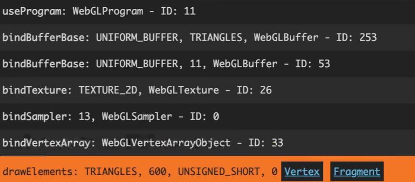
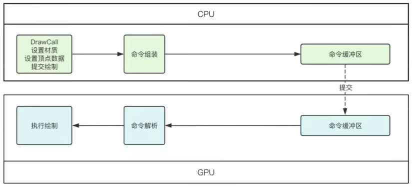

# DrawCall

### 什么是DrawCall

释义：图形API向GPU发起的一次绘制调用，如gl.drawElements

提交：材质（Shader、Uniform、纹理、渲染状态）、顶点数据

### CPU与GPU通信

CPU分批次向GPU提交DrawCall，一次提交N个

DrawCall会先放入缓冲区

CPU端缓冲区满了或者调用强制清空命令（flush/present），才会同步给GPU

