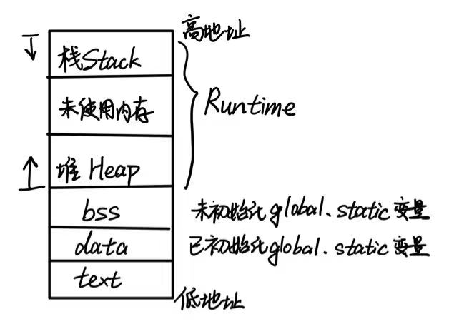
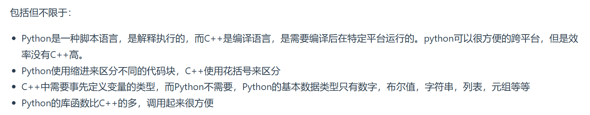
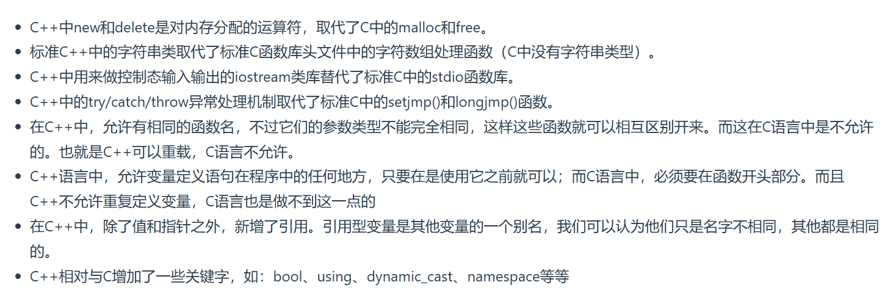

# 基础语法1-20

[TOC]

## 1.main函数执行之前和之后执行的代码可能是什么？

**main函数执行之前**：主要是初始化系统相关资源

- 设置栈指针
- **初始化s**tatic==静态变量==和global==全局变量==，即**.data**段的内容
- 将**未初始化**的==全局变量==**赋初值**：数值型short，int，long等为0，bool为False，指针为null等，即**.bss**段的内容
- ==全局对象==初始化，在main之前调用==构造函数==
- 将main函数的参数==argc，argv==等传递给main函数，然后才真正运行main函数

**main函数执行之后**：

- ==全局对象==的==析构函数==会在main函数之后执行


## 2.结构体内存对齐问题

- 结构体内成员**按照声明顺序存储**，**第一个成员地址和整个结构体地址相同**。
- 未特殊说明时，==按结构体中size最大的成员对齐==（若有double成员，按8字节对齐）
- C++11后引入两个关键字：**alignas可以指定结构体的对齐方式，alignof可以计算出类型的对齐方式**。
- alignas在指定值小于自然对其最小单位时被忽略。


## 3.指针和引用的区别

- 指针是一个变量，**存储的是一个地址**；引用跟原来的变量实质上是同一个东西，**是原变量的别名**
- 指针可以有很多级；引用只有一级
- 指针**可以为空**且在**定义时可以不被初始化**；引用**不能为空**且在**定义时必须初始化**，引用必须有具体实体
- **指针在初始化后可以改变指向；引用在初始化后不可再改变**
- sizeof指针得到的是本指针的大小；sizeof引用得到的是引用所指向变量的大小
- 当把指针作为参数进行传递时，也是将实参的一个**拷贝**传递给形参，两者指向的地址相同，但不是同一个变量，**在函数中改变这个变量的指向不影响实参**；当把引用作为参数进行传递时可以改变实参


## 4.在传递函数参数时，什么时候该使用指针，什么时候该使用引用呢

- 需要返回函数内局部变量的内存的时候用指针。使用指针传参需要开辟内存，用完要记得释放指针，不然会内存泄漏。而返回局部变量的引用是没有意义的。
- 对**栈空间**大小比较敏感（比如**递归**）的时候使用引用。==使用引用传递不需要创建临时变量==，开销要更小。
- 类对象作为参数传递的时候使用引用，这是C++类对象传递的标准方式


## 5.堆和栈的区别

- **申请方式不同**：栈由系统自动分配；堆由程序员申请和释放（容易产生Memory Leak）
- **申请大小限制不同**：栈顶和栈底是之前预设好的，栈由高地址向低地址扩展，大小固定；堆由低地址向高地址扩展，是不连续的内存区域，大小可以灵活调整
- **申请效率不同**：栈由系统分配，速度快，不会有碎片；堆由程序员分配，速度慢，且会有碎片

栈空间默认是4M，堆区一般是1G - 4G



分配方式：堆都是动态分配；栈有静态分配和动态分配，但栈的动态分配的资源由编译器自行释放


## 6.你觉得堆快一点还是栈快一点

毫无疑问是栈快一点。

因为**操作系统会在底层对栈提供支持**，会分配专门的寄存器存放栈的地址，栈的**入栈出栈操作也十分简单**，并且有专门的指令执行，所以栈的效率比较高也比较快。

而堆的操作是由C/C++函数库提供的，在分配堆内存的时候需要一定的算法寻找合适大小的内存。并且**获取堆的内容需要两次访问，第一次访问指针，第二次根据指针保存的地址访问内存**，因此堆比较慢。


## 7.区别以下指针类型

- int *p[10]：指针**数组**。是一个数组变量，数组大小为10，数组内每个元素都是zhixiangint类型的指针变量
- int (*p)[10]：数组**指针**。是一个指针变量，指向一个int数组，这个数组大小是10。
- int *p(int)：函数声明。函数名是p，形参是int类型，返回值是int指针类型。
- int (*p)(int)：函数指针。指向一个形参是int类型，返回值是int类型的函数。


## 8.new/delete与malloc/free的区别

相同点：都可用于内存的动态申请和释放

不同点：

- 前者是C++**运算符**，后者是C/C++**标准库函数**
- new**自动计算**要分配的空间大小，malloc需要**手动计算**
- new是**类型安全**的，malloc**不是类型安全**的（类型转换时无编译错误）
- new调用名为**operator new**的标准库函数分配足够空间并调用相关对象的**构造函数**，delete对指针所指对象运行适当的**析构函数**；然后通过调用名为**operator delete**的标准库函数释放该对象所用内存。后者均**没有相关调用**。
- 后者需要库文件支持，前者不用
- new是封装了malloc，直接free不会报错，但这只是释放内存，而不会析构对象


## 9.new和delete是如何实现的？

- new的实现过程是：首先调用名为**operator new**的标准库函数，**分配足够大的原始为类型化的内存**，以保存指定类型的一个对象；接下来运行该类型的一个**构造函数**，用指定**初始化的构造对象**；最后**返回指向新分配并构造后的对象的指针**
- delete的实现过程：对指针指向的对象运行适当的**析构函数**，然后通过调用名为**operator delete**的标准库函数释放该对象所用内存


## 10.new和malloc的区别

- new和delete是运算符，支持重载；malloc和free是标准库函数，支持覆盖
- new和delete除了**分配回收功能外**，还会调用**构造函数和析构函数**；malloc**仅仅分配内存空间**，free**仅仅回收空间**，**不具备调用构造函数和析构函数**功能
- new和delete返回的是**具体类型指针**，malloc和free返回的是**void类型指针（必须进行类型转换）**


## 11.既然有了malloc/free，C++中为什么还需要new/delete呢？直接用malloc/free不好吗？

在对**非基本数据类型的对象**使用的时候，对象创建的时候还需要执行**构造函数**，销毁的时候还需要执行**析构函数**。而malloc/free是库函数，是已经编译的代码，所以**不能把构造函数和析构函数的功能强加给malloc/free**，所以new/delete是必不可少的。


## 12.被free回收的内存是立即返还给操作系统吗？

不是的，被free回收的内存会首先被ptmalloc使用双链表保存起来，当用户下一次申请内存的时候，**会尝试从这些内存中寻找合适的返回**。这样就避免了频繁的系统调用，占用过多的系统资源。同时ptmalloc也会尝试对小块内存进行合并，避免过多的内存碎片。


## 13.宏定义和函数有何区别？

- 宏在预处理阶段完成替换，之后被替换的文本参与编译，相当于**直接插入了代码**，运行时不存在函数调用，**执行起来更快**；函数调用在运行时需要跳转到具体调用代码
- 宏定义属于在结构中插入代码，**没有返回值**；函数调用具**有返回值**
- 宏定义参数没有类型，**不进行类型检查**；函数参数具有类型，**需要检查类型**
- **宏定义不要在最后加分号**


## 14.宏定义和typedef区别

宏主要用于定义常量及书写复杂的内容；typedef主要用于定义类型别名

宏替换发生在编译阶段之前，属于文本插入替换；typedef是编译的一部分

宏不检查类型；typedef会检查数据类型

宏不是语句，不在最后加分号；typedef是语句，要加分号表示结束

注意对指针的操作，typedef char* p_char和#define p_char char*区别巨大

> // typedef 示例
> typedef char* p_char;
> p_char a, b; // a 和 b 都是 char* 类型的指针
>
> // #define 示例
> #define p_char char*
> p_char a, b; // a 是 char* 类型的指针，b 是 char 类型的变量


## 15.变量声明和定义的区别

声明仅仅是把变量的声明的位置及类型提供给编译器，**并不分配内存空间**；定义要在定义的地方**为其分配存储空间**

相同变量**可以在多处声明**（外部变量extern），但**只能在一处定义**


## 16.strlen和sizeof区别

sizeof是**运算符**，不是函数，**结果在编译时而非运行中获得**；strlen是字符处理的库函数

sizeof参数可以是**任何数据的类型或者数据**；strlen的参数**只能是字符指针且结尾是’\0‘的字符串**

因为sizeof值在编译时确定，所以**不能用来得到动态分配（运行时分配）存储空间的大小**

```c++
  int main(int argc, char const *argv[]){
      
      const char* str = "name";

      sizeof(str); // 取的是指针str的长度，是8
      strlen(str); // 取的是这个字符串的长度，不包含结尾的 \0。大小是4
      return 0;
  }
```

>一个指针占内存的大小跟编译环境有关，而与机器的位数无关


## 17.常量指针和指针常量的区别

指针常量是一个**指针**，**指向一个只读变量**，可以写作int * const ptr

常量指针是一个**不能改变指向的指针**。**指针是个常量**，必须初始化，一旦初始化完成，它的值就不能再改变了，即不能中途改变指向，写作const int *ptr


## 18.a和&a有什么区别

假设数组int a[10]; int(*p)[10] = &a;其中：

a是数组名，是数组首元素地址。当你对`a`加1时，实际上是移动到数组的下一个元素（`a[1]`），即地址增加`sizeof(int)`。

&a是数组的指针。当你对`&a`加1时，实际上是移动到下一个数组的位置，即地址增加`sizeof(int[10])`，也就是数组整个大小的偏移。

若(int*)p，此时输出 *p时，其值为a[0]的值，因为被转为int *类型，解引用时按照int类型大小来读取


## 19.C++和Python的区别




## 20.C++和C语言的区别

