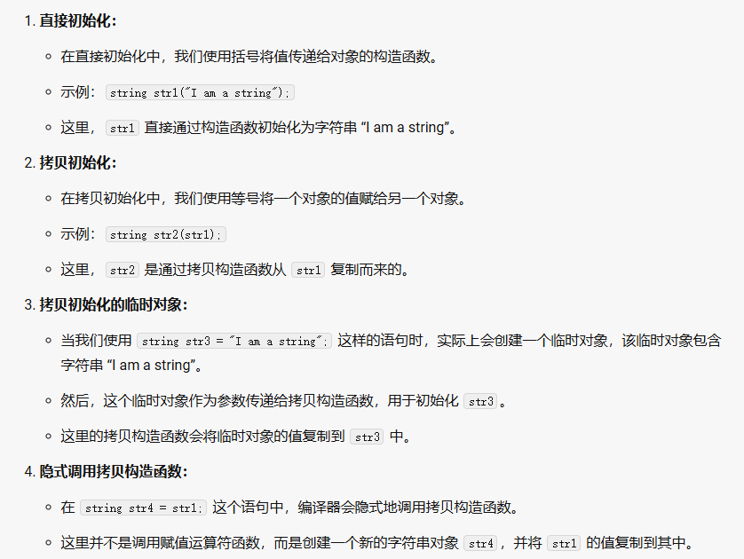
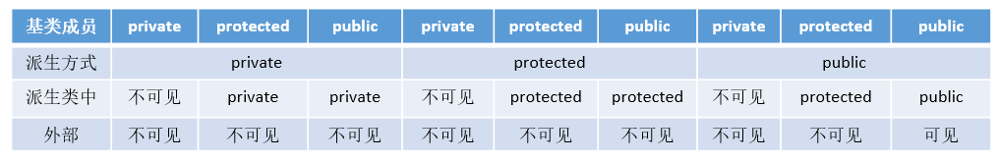
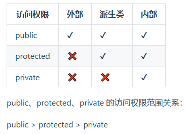
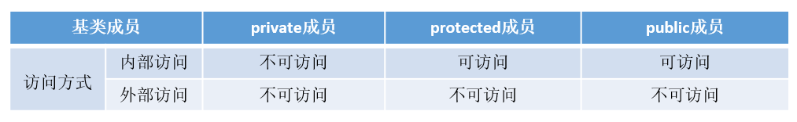
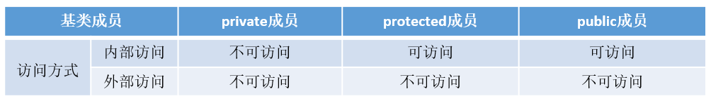
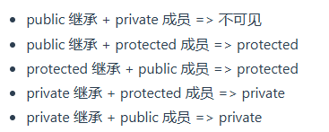
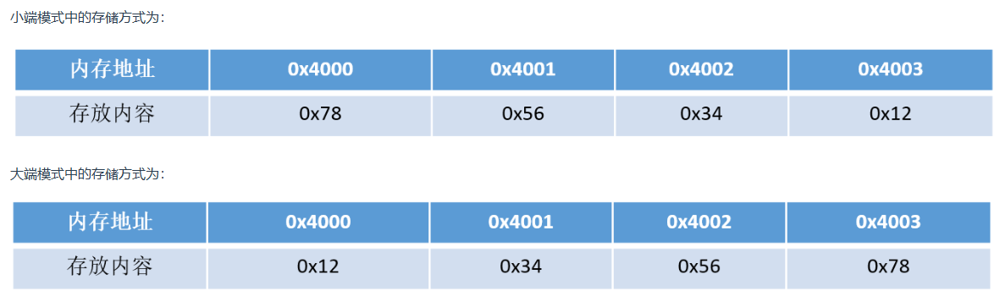

# 基础语法21-40

[TOC]

## 21.C++与Java的区别

## 22.C++中struct和class的区别

相同点：

- 两者都拥有成员函数、公共和私有部分
- 任何可以用class完成的工作，同样可以使用struct完成

不同点：

- 两者中如果不对**成员**指定公私有，**struct默认是public的，class默认是private的**
- **struct默认是public继承，而class默认是private继承**

引申：C++和C的struct的区别

- C中：struct是用户自定义数据类型（UDT）；C++中struct是抽象数据类型（ADT），（C++中的struct能继承，能实现多态）
- C中struct是**没有权限的设置的**，且struct中只能是一些变量的集合体，可以封装数据却不可以隐藏数据，而且**成员不可以是函数**
- C++中，struct**增加了访问权限**，且可以和类一样**有成员函数**，成员默认访问说明符为public（为了与C兼容）
- C中struct作为类的一种特例是用来自定义数据结构的。一个结构标记声明后，**在C中必须在结构标记前加上struct**，才能做结构类型名；C++中结构体标记（结构体名）可以**直接作为结构体类型名**使用，此外结构体struct在C++中被当作类的一种特例

## 23.define宏定义和const的区别

编译阶段

- define是在编译的**预处理阶段**起作用，而const是在**编译、运行时**起作用

安全性

- define只做替换，**不做类型检查和计算，也不求解**，容易产生错误，一般最好加上一个大括号包含住全部的内容，要不然很容易出错
- const常量有数据类型，**编译器可以对其进行类型安全检查**

内存占用

- define只是将宏名称进行替换，**在内存中会产生多份相同的备份**。**const在程序运行中只有一份备份**，且可以执行常量折叠，能将复杂的表达式计算出结果放入常量表
- 宏替换发生在编译阶段之前，属于文本插入替换；const作用发生于编译过程中
- 宏不检查类型；const会检查数据类型
- **宏定义的数据没有分配内存空间，只是插入替换掉**；**const定义的变量只是值不能改变，但要分配内存空间**

## 24.C++中const和static的作用

**static**

- 不考虑类的情况
  - 隐藏。所有不加static的全局变量和函数具有全局可见性，可以在其他文件中使用，**加了之后只能在该文件所在的编译模块中使用**
  - 默认初始化为0，包括未初始化的全局静态变量与局部静态变量，都存在全局未初始化区。
  - 静态变量在函数内定义，始终存在，且**只进行一次初始化**，具有记忆性，其作用范围与局部变量相同，**函数退出后依然存在，但不能使用**
- 考虑类的情况
  - static成员变量：只**与类关联，不与类的对象关联**。定义时要分配空间，不能在类声明中初始化，必须在类定义体外部初始化，初始化时不需要标识为static，可以被非static成员函数任意访问。对于整型的`const static`成员变量，你可以在类内部进行初始化，但这仅适用于整型和枚举类型，并且初始化值必须是编译时常量。
  - static成员函数：**不具有this指针**，**无法访问类对象的非static成员变量和非static成员函数**，**不能被声明为const、虚函数和volatile**；可以被非static成员函数任意访问

**const**

- 不考虑类的情况

  - const常量在定义时必须初始化，之后无法更改
  - const形参可以接受const和非const类型的实参

- 考虑类的情况

  - const成员变量：不能在类定义外部初始化，只能通过**构造函数初始化列表**进行初始化，并且**必须有构造函数**；不同类对其const数据成员的值可以不同，所以不能在类中声明时初始化

    ```c++
    class MyClass {
    public:
        const int myConstVar;
        MyClass(int value) : myConstVar(value) {} // 初始化列表中初始化
    };
    ```

  - const成员函数：**const对象不可以调用非const成员函数**；非const对象都可以调用；不可以改变非mutable数据的值

  - 补充：**const修饰变量也是与static一样有隐藏作用**，只能在该文件中使用，其他文件不可以引用声明使用。因此在头文件中声明const变量是没问题的，因为即使被多个文件包含，链接性都是内部的，不会出现符号冲突

## 25.C++的顶层const和底层const

概念区分：

- 顶层const：指的是const修饰的变量本身是一个常量，无法修改。指的是指针，就是*号的右边
- 底层const：指的是const修饰的变量所指的对象是要给常量，指的是所指变量，就是*号的左边

```c++
int a = 10;int* const b1 = &a;        //顶层const，b1本身是一个常量
const int* b2 = &a;       //底层const，b2本身可变，所指的对象是常量
const int b3 = 20; 		   //顶层const，b3是常量不可变
const int* const b4 = &a;  //前一个const为底层，后一个为顶层，b4不可变
const int& b5 = a;		   //用于声明引用变量，都是底层const
```

区分作用

- 执行对象拷贝时有限制，常量的底层const不能赋值给非常量的底层const
- 使用命名的强制类型转换函数**const_cast**时，只能改变**运算对象的底层const**

## 26.数组名和指针

- 二者均可通过增减偏移量来访问数组中的元素
- 数组名不是真正意义上的指针，可以理解为常指针，所以数组名没有自增、自减等操作
- 当数组名当作形参传递给调用函数后，就失去了原有特性，**退化成一般指针**，多了自增、自减操作，但sizeof运算符不能再得到原数组的大小了

```c++
#include <iostream>
void printArraySize(int arr[]) {
    // 在这里，arr 是一个指向数组首元素的指针
    // sizeof(arr) 返回指针的大小，而不是数组的大小
    std::cout << "Size of arr in bytes: " << sizeof(arr) << std::endl;
}

int main() {
    int myArray[] = {1, 2, 3, 4, 5};
    printArraySize(myArray);
    return 0;
}
```

## 27.final和override关键字

**override**

当在父类中使用了虚函数的时候，可能需要在某个**子类中对这个虚函数进行重写**

```c++
class A
{
    virtual void foo();
}
class B : public A
{
    void foo(); //正确
    virtual void foo(); // 正确
    void foo() override; //正确
    virtual void foo() override; //正确
}
```

```c++
class A
{
    virtual void foo();
};
class B : public A
{
    virtual void f00(); //正确，这个函数是B新增的，不是继承的
    virtual void f0o() override; //Error, 加了override之后，这个函数一定是继承自A的，A找不到就报错
};
```

**final**

当**不希望某个类被继承，或不希望某个虚函数被重写**，可以在类名和虚函数后添加final关键字，添加final关键字后如果被继承或重写，编译器会报错。

```c++
class Base
{
    virtual void foo();
};
 
class A : public Base
{
    void foo() final; // foo 被override并且是最后一个override，在其子类中不可以重写
};

class B final : A // 指明B是不可以被继承的
{
    void foo() override; // Error: 在A中已经被final了
};
 
class C : B // Error: B is final
{
};

```

## 28.拷贝初始化和直接初始化

当用于类类型对象时，初始化的拷贝形式和直接形式有所不同：

- 直接初始化直接调用**与实参匹配的构造函数**，拷贝初始化总是调用**拷贝构造函数**。
- 拷贝初始化首先使用指定构造函数创建一个临时对象，然后用拷贝构造函数将那个临时对象拷贝到正在创建的对象。

```c++
string str1("I am a string");//语句1 直接初始化
string str2(str1);//语句2 直接初始化，str1是已经存在的对象，直接调用拷贝构造函数对str2进行初始化
string str3 = "I am a string";//语句3 拷贝初始化，先为字符串”I am a string“创建临时对象，再把临时对象作为参数，使用拷贝构造函数构造str3
string str4 = str1;//语句4 拷贝初始化，这里相当于隐式调用拷贝构造函数，而不是调用赋值运算符函数
```

- 为了提高效率，允许编译器跳过创建临时对象这一步，直接调用构造函数构造要创建的对象，这样就完全等价于直接初始化了（语句1和语句3等价），但是需要辨别两种情况。

  - 当拷贝构造函数为private时：语句3和语句4在编译时会报错

  - 使用explicit修饰构造函数时：如果构造函数存在隐式转换，编译时会报错

>`explicit` 是 C++ 中的一个关键字，用于修饰只有一个参数的类构造函数，以表明该构造函数是显式的，而非隐式的。当使用 `explicit` 修饰构造函数时，它将禁止类对象之间的隐式转换，以及禁止隐式调用拷贝构造函数。
>
>```c++
>class Date {
>public:
>    explicit Date(int year) : _year(year) {}
>private:
>    int _year;
>};
>```



## 29.初始化和赋值的区别

对简单类型来说，初始化和赋值没什么区别

对类和复杂数据类型来说，这两者有区别，举例：

```c++
class A{
public:
    int num1;
    int num2;
public:
    A(int a=0, int b=0):num1(a),num2(b){};
    A(const A& a){};
    //重载 = 号操作符函数
    A& operator=(const A& a){
        num1 = a.num1 + 1;
        num2 = a.num2 + 1;
        return *this;
    };
};
int main(){
    A a(1,1);
    A a1 = a; //拷贝初始化操作，调用拷贝构造函数
    A b;
    b = a;//赋值操作，对象a中，num1 = 1，num2 = 1；对象b中，num1 = 2，num2 = 2
    return 0;
}
```

## 30.extern"C"的用法

为了能够正确的在C++代码中调用C语言的代码：在程序中加上extern "C"后，相当于告诉编译器这部分代码**要按照C语言进行编译**。C语言中不支持extern "C"声明，在.c文件中包含了extern "C"时会出现编译语法错误。所以**使用extern "C"全部都放在于cpp程序相关文件或其头文件中**。

哪些情况下使用extern "C"：

（1）C++代码中调用C语言代码

（2）在C++中的头文件中使用

（3）多人协同开发时

## 31.野指针和悬空指针

都是指向无效内存区域，访问行为将会导致未定义行为

野指针

- 野指针，指的是没有初始化过的指针。
- 因此，为了防止出错，对于指针初始化时都是赋值为nullptr，这样在使用时编译器就不会直接报错，产生非法内存访问。

悬空指针

- 悬空指针，指针最初指向的内存已经被释放了的一种指针

```c++
int main(void) { 
  int * p = nullptr;
  int* p2 = new int;
  
  p = p2;

  delete p2;
}
```

- 此时p和p2就是悬空指针，指向的内存已经被释放。继续使用这两个指针，行为不可预料。需要设置p=p2=nullptr。C++智能指针的本质就是避免悬空指针的产生。

产生原因及解决办法：

- 野指针：指针变量未即使初始化->定义指针变量及时初始化，要么置空
- 悬空指针：指针free或delete之后没有及时置空->释放操作后立即置空

## 32.C++的类型安全

什么是类型安全：

- 类型安全很大程度上可以等价于内存安全。类型安全的代码不会试图访问自己没被授权的内存区域。

相比C语言，C++提供了一些新的机制保障类型安全：

- 操作符**new返回的指针类型严格与对象匹配**，而不是void*
- C中很多以void*为参数的函数可以改写为**C++模板函数**，而模板是支持类型检查的
- 引入**const关键字代替#define constants**，它是有类型、有作用域的，而#define constants只是简单的文本替换

- 一些**#define宏可被改写为inline函数**，结合函数的重载，可在类型安全的前提下支持多种类型，当然改写为模板也能保证类型安全
- C++提供了**dynamic_cast关键字**，使得转换过程更加安全，因为dynamic_cast比static_cast涉及更多具体的类型检查。`dynamic_cast` 提供了运行时类型安全检查，适用于**多态类型转换**，而 `static_cast` 提供了编译时类型转换，没有运行时检查，效率更高，但可能导致未定义行为。

## 33.C++中的重载、重写（覆盖）和隐藏的区别

（1）重载（overload）

同一范围定义中的同名成员函数，函数名相同，**参数类型和数目有所不同**。不能出现参数个数和类型均相同，仅仅依靠返回值不同来区分的函数。重载和函数成员是否是虚函数无关。

（2）重写（覆盖）（override）

重写指的是**在派生类中覆盖基类中的同名函数**，重写就是重写函数体，要求**基类函数必须是虚函数**且：

- 与基类的虚函数有相同的参数个数
- 与基类的虚函数有相同的参数类型
- 与基类的虚函数有相同的返回值类型

（3）隐藏（hide）

隐藏指的是某些情况下，派生类中的函数屏蔽了基类中的同名函数，包括：

- 两个函数参数相同，但是**基类函数不是虚函数**。
- 两个函数参数不同，无论基类函数是不是虚函数，都会被隐藏。和重载的区别在于**两个函数不在同一个类中**。

## 34.C++有哪几种的构造函数

C++中的构造函数可以分为4类：

- 默认构造函数 ： 没有参数
- 初始化构造函数（有参数）：有参数和参数列表
- 拷贝构造函数
- 移动构造函数（move和右值引用）
- 委托构造函数
- 转换构造函数：形参是其他类型变量，且只有一个形参

```c++
    Student(){//默认构造函数，没有参数
        this->age = 20;
        this->num = 1000;
    };  
    Student(int a, int n):age(a), num(n){}; //初始化构造函数，有参数和参数列表
    Student(const Student& s){//拷贝构造函数，这里与编译器生成的一致
        this->age = s.age;
        this->num = s.num;
    }; 
    Student(int r){   //转换构造函数,形参是其他类型变量，且只有一个形参
        this->age = r;
		this->num = 1002;
    };
```

默认构造函数和初始化构造函数在定义类的对象，完成对象的初始化工作

拷贝构造函数用于拷贝本类的对象

转换构造函数用于将其它类型的变量隐式转换为本类对象

## 35.浅拷贝和深拷贝的区别

浅拷贝

- 浅拷贝只是拷贝一个指针，并没有开辟一个新地址，拷贝的指针和原来的指针指向同一块地址，如果原来的指针所指向的资源释放了，那么再释放浅拷贝的指针的资源就会出现错误。

  例子

  ```c++
  class MyClass {
  public:
      int* data;
  
      MyClass(int value) {
          data = new int(value);
      }
  
      // 浅拷贝构造函数
      MyClass(const MyClass& other) {
          data = other.data;  // 仅复制指针
      }
      ~MyClass() {
          delete data;  // 当多个对象共享相同的指针时，这会导致问题
      }
      void print() const {
          std::cout << "Data: " << *data << std::endl;
      }
  };
  
  int main() {
      MyClass obj1(10);
      MyClass obj2 = obj1;  // 使用浅拷贝构造函数
  
      obj1.print();  // 输出 "Data: 10"
      obj2.print();  // 输出 "Data: 10"
  
      // 修改 obj2 的数据会影响 obj1
      *obj2.data = 20;
  
      obj1.print();  // 输出 "Data: 20"
      obj2.print();  // 输出 "Data: 20"
  
      return 0;  // 当程序结束时，obj1 和 obj2 都会尝试删除相同的内存，导致未定义行为
  }
  ```

深拷贝

- 深拷贝不仅拷贝值，还开辟出一块新的空间用来存放新的值，即使原先的对象被析构掉，释放内存了也不会影响到深拷贝得到的值。在自己实现拷贝赋值的时候，如果有指针变量的话是需要自己实现深拷贝的。

例子

```c++
class MyClass {
public:
    int* data;

    MyClass(int value) {
        data = new int(value);
    }

    // 深拷贝构造函数
    MyClass(const MyClass& other) {
        data = new int(*other.data);  // 分配新的内存并复制数据
    }

    ~MyClass() {
        delete data;  // 安全地删除数据
    }

    void print() const {
        std::cout << "Data: " << *data << std::endl;
    }
};

int main() {
    MyClass obj1(10);
    MyClass obj2 = obj1;  // 使用深拷贝构造函数

    obj1.print();  // 输出 "Data: 10"
    obj2.print();  // 输出 "Data: 10"

    // 修改 obj2 的数据不会影响 obj1
    *obj2.data = 20;

    obj1.print();  // 输出 "Data: 10"
    obj2.print();  // 输出 "Data: 20"

    return 0;
}
```

## 36.内联函数和宏定义的区别

- 宏只做**简单字符串替换**（编译前）。而内联函数可以**进行参数类型检查**（编译时），且**具有返回值**。
- 内联函数在编译时直接将函数代码嵌入到目标代码中，**省去函数调用的开销**来提高执行效率，并且进行参数类型检查，具有返回值，可以实现重载。
- 宏定义时要注意书写（**参数要括起来**）否则容易出现歧义，内联函数不会产生歧义
- 内联函数有**类型检测、语法判断**等功能，而宏没有

内联函数适用场景：

- 使用宏定义的地方都可以使用inline函数
- 作为类成员接口函数来读写类的私有成员或保护成员，会提高效率

## 37.public，protected和private访问和继承权限public/protected/private的区别

- public的变量和函数在类的内部外部都可以访问
- protected的变量和函数只能在**类的内部和其派生类**中访问
- private修饰的元素只能在类内访问

**访问权限**

派生类可以继承基类中除了构造/析构、赋值运算符重载函数之外的成员，但是这些成员的访问属性在派生过程中也是可以调整的，三种派生方式的访问权限如下表所示：注意外部访问并不是真正的外部访问，而是在**通过派生类的对象对基类成员的访问**。

（派生方式即为继承方式）





**继承权限**

public继承

**公有继承**的特点是基类的**公有成员和保护成员作为派生类的成员时都保持原有的状态**，而基类的私有成员仍然是私有的，不能被这个派生类的子类所访问。

protected继承

**保护继承**的特点是基类的所有**公有成员和保护成员都成为派生类的保护成员**，并且只能被它的派生类成员函数或友元函数访问，基类的私有成员依然是私有的



private继承

私有继承的特点是基类的所有**公有成员和保护成员都成为派生类的私有成员**，并不被它的派生类的子类所访问，基类的成员只能由自己派生类访问，无法再往下继承





## 38.如何用代码判断大小端存储

小端存储：子数据的低字节存储在低地址中（低存低）

大端存储：字数据的高字节存储在低地址中（高存低）

所以在**Socket编程**中，往往需要将操作系统所用的小端存储的IP地址转换为大端存储，这样才能进行网络传输



在代码中判断：

方式一：使用强制类型转换

```c++
#include <iostream>
using namespace std;
int main()
{
    int a = 0x1234;
    //由于int和char的长度不同，借助int型转换成char型，只会留下低地址的部分
    char c = (char)(a);
    if (c == 0x12)
        cout << "big endian" << endl;
    else if(c == 0x34)
        cout << "little endian" << endl;
}
```

方式二：巧用union联合体

>`union` 是 C++ 中的一种数据结构，类似于 `struct`，但有一些不同之处。`union` 允许在同一内存位置存储不同的数据类型，因此它的所有成员共享相同的内存空间。使用 `union` 可以节省内存，但需要注意其使用的限制和潜在的风险。

```c++
#include <iostream>
using namespace std;
//union联合体的重叠式存储，endian联合体占用内存的空间为每个成员字节长度的最大值
union endian
{
    int a;
    char ch;
};
int main()
{
    endian value;
    value.a = 0x1234;
    //a和ch共用4字节的内存空间
    if (value.ch == 0x12)
        cout << "big endian"<<endl;
    else if (value.ch == 0x34)
        cout << "little endian"<<endl;
}
```

## 39.volatile、mutable和explicit关键字的用法

**volatile**

- volatile关键字是一种类型修饰符，用它声明的类型变量表示**可以被某些编译器未知的因素更改**，比如：操作系统、硬件或其它线程等。遇到这个关键字声明的变量，**编译器对访问该变量的代码就不再进行优化**，从而可以提供对特殊地址的稳定访问。
- 当要求使用volatile声明的变量的值的时候，**系统总是重新从它所在的内存读取数据**，即使它前面的指令刚刚从该处读取过数据。**多线程中被几个任务共享的变量需要定义为volatile类型**：作用是防止优化编译器把变量从内存装入CPU寄存器中。

**mutable**

- 有些时候需要在const函数里面修改一些跟类状态无关的数据成员，那么这个变量就应该被mutable来修饰。

**explicit**

- explicit关键字用来修饰类的构造函数，被修饰的构造函数的类**不能发生相应的隐式类型转换，只能以显式的方式进行类型转换**，注意：
- explicit关键字只能用于**类内部的构造函数声明**上
- 被explicit修饰的构造函数的类，不能发生相应的隐式类型转换

```c++
class Complex {
public:
    int real;
    int imag;
    // 使用 explicit 关键字防止隐式转换
    explicit Complex(int r, int i = 0) : real(r), imag(i) {}

    void display() const {
        std::cout << "Real: " << real << ", Imaginary: " << imag << std::endl;
    }
};
void printComplex(const Complex& c) {
    c.display();
}
int main() {
    Complex c1(3, 4);
    c1.display();
    // Complex c2 = 5;  // 错误：不能隐式调用带 explicit 的构造函数
    Complex c2(5);      // 正确：显式调用构造函数
    c2.display();
    printComplex(c1);
    // printComplex(10); // 错误：不能隐式转换 int 到 Complex
    printComplex(Complex(10)); // 正确：显式转换
    return 0;
}
```

## 40.什么情况下会调用拷贝构造函数

- 用**类的一个实例化对象去初始化另一个对象**的时候
- 函数的**参数是类的对象**时（非引用传递）
- 函数的返回值是函数体内局部对象的类的对象时，此时虽然发生NRV优化，但是由于返回方式是值传递，所以会**在返回值的地方调用拷贝构造函数**

```c++
class A
{
public:
	A() {};
	A(const A& a)
	{
		cout << "copy constructor is called" << endl;
	};
	~A() {};
};

void useClassA(A a) {}

A getClassA()//此时会发生拷贝构造函数的调用，虽然发生NRV优化，但是依然调用拷贝构造函数
{
	A a;
	return a;
}

//A& getClassA2()//  VS2019下，此时编辑器会进行（Named return Value优化）NRV优化,不调用拷贝构造函数 ，如果是引用传递的方式返回当前函数体内生成的对象时，并不发生拷贝构造函数的调用
//{
//	A a;
//	return a;
//}

int main()
{
	A a1,a3,a4;
	A a2 = a1;  //调用拷贝构造函数,对应情况1
	useClassA(a1);//调用拷贝构造函数，对应情况2
	a3 = getClassA();//发生NRV优化，但是值返回，依然会有拷贝构造函数的调用 情况3
	a4 = getClassA2(a1);//发生NRV优化，且引用返回自身，不会调用
    return 0;
}

```

