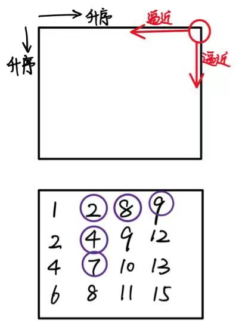

# 二维数组中的查找

[TOC]

[240. 搜索二维矩阵 II - 力扣（LeetCode）](https://leetcode.cn/problems/search-a-2d-matrix-ii/description/)

[LCR 121. 寻找目标值 - 二维数组 - 力扣（LeetCode）](https://leetcode.cn/problems/er-wei-shu-zu-zhong-de-cha-zhao-lcof/description/)

## 题目描述

在一个二维数组中（每个一维数组的长度相同），每一行都按照从左到右递增的顺序排序，每一列都按照从上到下递增的顺序排序。请完成一个函数，输入这样的一个二维数组和一个整数，判断数组中是否含有该整数。

```
[
 [1,2,8,9],
 [2,4,9,12],
 [4,7,10,13],
 [6,8,11,15]
]
```

给定 target = 7，返回 true。

给定 target = 3，返回 false。

## 解法

### 方法一：直接暴力查找

我们直接遍历整个矩阵 matrix，判断 target 是否出现即可。
```c++
class Solution {
public:
    bool searchMatrix(vector<vector<int>>& matrix, int target) {
        for (const auto& row: matrix) {
            for (int element: row) {
                if (element == target) {
                    return true;
                }
            }
        }
        return false;
    }
};
```

时间复杂度：O(mn)。

空间复杂度：O(1)。

### 方法二：二分查找

由于矩阵 matrix 中每一行的元素都是升序排列的，因此我们可以对每一行都使用一次二分查找，判断 target 是否在该行中，从而判断 target 是否出现。

```c++
class Solution {
public:
    bool searchMatrix(vector<vector<int>>& matrix, int target) {
        for (const auto& row: matrix) {
            auto it = lower_bound(row.begin(), row.end(), target);//实际上是用二分法来实现的
            if (it != row.end() && *it == target) {
                return true;
            }
        }
        return false;
    }
};
```

时间复杂度：O(mlogn)。对一行使用二分查找的时间复杂度为 O(logn)，最多需要进行 m 次二分查找。

空间复杂度：O(1)。

### ==方法三：Z 字形查找==

我们可以从矩阵 matrix 的==右上角== (0,n−1) 进行搜索。在每一步的搜索过程中，如果我们位于位置 (x,y)，那么我们希望在以 matrix 的左下角为左下角、以 (x,y) 为右上角的矩阵中进行搜索，即行的范围为 [x,m−1]，列的范围为 [0,y]：

如果 matrix[x,y]=target，说明搜索完成；

如果 matrix[x,y]>target，由于每一列的元素都是升序排列的，那么在当前的搜索矩阵中，所有位于第 y 列的元素都是严格大于 target 的，因此我们可以将它们全部忽略，即将 **y 减少 1**；

如果 matrix[x,y]<target，由于每一行的元素都是升序排列的，那么在当前的搜索矩阵中，所有位于第 x 行的元素都是严格小于 target 的，因此我们可以将它们全部忽略，即将 **x 增加 1**。

在搜索的过程中，如果我们超出了矩阵的边界，那么说明矩阵中不存在 target。

```c++
class Solution {
public:
    bool searchMatrix(vector<vector<int>>& matrix, int target) {
        if(matrix.size()==0) return false;
        int m = matrix.size();
        int n = matrix[0].size();
        int x = 0, y = n-1;
        while(x<m && y >= 0)
        {
            if(matrix[x][y]==target) return true;
            else if (matrix[x][y] > target) y--;
            else x++;
        }
        return false;
    }
};
```



时间复杂度：==O(m+n)==。在搜索的过程中，如果我们没有找到 target，那么我们要么将 y 减少 1，要么将 x 增加 1。由于 (x,y) 的初始值分别为 (0,n−1)，因此 y 最多能被减少 n 次，x 最多能被增加 m 次，总搜索次数为 m+n。在这之后，x 和 y 就会超出矩阵的边界。

空间复杂度：O(1)。
