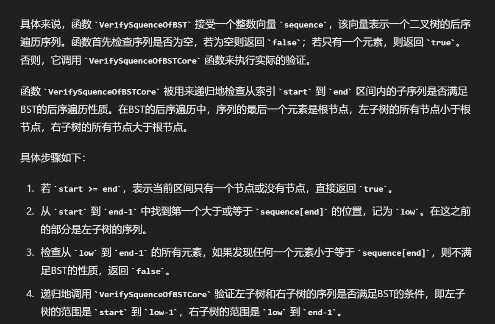

# 二叉搜索树的后序遍历序列

[TOC]

[二叉搜索树的后序遍历序列_牛客题霸_牛客网 (nowcoder.com)](https://www.nowcoder.com/practice/a861533d45854474ac791d90e447bafd?tpId=13&&tqId=11176&rp=1&ru=/ta/coding-interviews&qru=/ta/coding-interviews/question-ranking)

[LCR 152. 验证二叉搜索树的后序遍历序列 - 力扣（LeetCode）](https://leetcode.cn/problems/er-cha-sou-suo-shu-de-hou-xu-bian-li-xu-lie-lcof/description/)


## 题目描述

输入一个整数数组，判断该数组是不是某二叉搜索树的后序遍历的结果。如果是则返回 true ,否则返回 false 。假设输入的数组的任意两个数字都互不相同。


## 解法

### 利用二叉搜索树的性质+后序遍历的性质

```c++
class Solution {
public:
    bool VerifySquenceOfBST(vector<int> sequence) {
        if(sequence.empty()) return false;
        if(sequence.size()==1) return true;
        return VerifySquenceOfBSTRecur(sequence,0,sequence.size()-1);
    }
    bool VerifySquenceOfBSTRecur(vector<int>& sequence, int start, int end)
    {
        if(start>=end) return true;
        int low = start;
        while(low<end && sequence[low]<sequence[end])
        {
            low++;
        }
        for(int i = low; i<end; ++i)
        {
            if(sequence[i] <= sequence[end]) return false;
        }
        return VerifySquenceOfBSTRecur(sequence,start,low-1) 
        && VerifySquenceOfBSTRecur(sequence,low,end-1);

    }
};
```




临时刷到一道：

[590. N 叉树的后序遍历 - 力扣（LeetCode）](https://leetcode.cn/problems/n-ary-tree-postorder-traversal/)

```c++
class Solution {
public:
    vector<int> result;
    vector<int> postorder(Node* root) {
        if(root==nullptr) return result;
        for(auto child : root->children)
        {
            postorder(child);
        }
        result.push_back(root->val);
        return result;
    }
};
```

push_back可以改成emplace_back不需要创建临时对象
